# WATeamInbox

A multi-user WhatsApp team inbox for managing customer conversations, assignments, contacts, groups, and team workflows from one web application.

> [!WARNING]
> **Open-source beta:** interfaces, migrations, and behavior may change without backward compatibility. The development defaults are not production-hardened. Evaluate the software, its unofficial WhatsApp integration, data handling, backups, monitoring, and account-risk implications before any production use.

WATeamInbox is an independent project and is not affiliated with, endorsed by, or sponsored by WhatsApp or Meta. It uses an unofficial WhatsApp client library; use may be affected by WhatsApp policy or protocol changes and can result in account restrictions or bans. No account-safety guarantee is provided. Third-party names are used only to describe interoperability; all trademarks belong to their respective owners.

**Service status:** the public marketing site and double-opt-in Cloud waitlist are live. The waitlist records interest only: WATeamInbox Cloud is not an available hosted product, and no pricing, launch date, feature set, SLA, account, or support entitlement is promised. Self-hosting this beta is currently the only product path. The WATeamInbox-operated waitlist is covered by the public [waitlist privacy notice](https://wateaminbox.com/privacy).

## Features

- Multi-account WhatsApp connectivity powered by whatsmeow
- Shared realtime inbox with message status, reactions, media, presence, and typing indicators
- Contact assignment and role-based conversation visibility
- Contact profiles, notes, tags, labels, and bulk import/export
- Groups, quick replies, search, analytics, audit logs, and team management
- In-app notification center, desktop notifications, realtime toasts, and optional Web Push
- Tenant-isolated PostgreSQL schemas
- Durable commands and events through NATS JetStream

## Architecture

```mermaid
flowchart TB
    web["React web app"]
    api["Hono API<br/>(Bun)"]
    centrifugo["Centrifugo"]
    nats["NATS JetStream"]
    postgres["PostgreSQL"]
    storage["S3-compatible media storage"]
    orchestrator["Go orchestrator"]
    worker["WhatsApp worker<br/>(whatsmeow)"]

    web <-->|HTTP| api
    web -->|WebSocket| centrifugo
    api -->|HTTP publish| centrifugo
    api <-->|durable commands/events| nats
    centrifugo <-->|NATS broker| nats
    api <-->|application data| postgres
    api <-->|media| storage
    nats --> orchestrator
    orchestrator -->|manages| worker
    worker <-->|sessions/messages| postgres
    worker <-->|media| storage
```



### Repository layout

| Path | Purpose |
| --- | --- |
| `apps/web` | React 19, Vite, Tailwind CSS, TanStack Query |
| `apps/api` | Hono API running on Bun |
| `apps/marketing` | Astro marketing site |
| `apps/waitlist-api` | Cloudflare Worker for the optional Cloud waitlist, double opt-in, and private administrator dashboard |
| `packages/database` | Kysely database client and migrations |
| `packages/shared` | Shared TypeScript types and utilities |
| `packages/ui` | Shared React components |
| `services/orchestrator` | Go process manager for WhatsApp workers |
| `services/whatsapp` | Go WhatsApp worker using whatsmeow |
| `services/shared` | Shared Go packages |

### Beta limitations

- The supplied production topology is one API and one orchestrator on a single host; high availability and horizontal orchestrator scaling are not supported by the baseline.
- Rate limiting is in memory unless an operator adds and validates shared Redis for multiple API replicas.
- WhatsApp history depends on what the primary device and protocol make available. Protocol changes can interrupt pairing, sync, or delivery.
- Durable messaging is at-least-once. A crash after WhatsApp accepts a send but before the result is recorded can leave delivery outcome uncertain and requires operator reconciliation.
- Scheduled and bulk sends are paced and capped, but those controls do not establish recipient consent or guarantee account safety. Media uploads are capped at 50 MiB.
- Operators remain responsible for backups, restores, monitoring, retention, privacy/compliance, abuse prevention, dependency updates, and incident response.

## Prerequisites

- [Bun](https://bun.sh/) 1.2.18 or newer
- [Go](https://go.dev/) 1.25 or newer
- [Docker](https://www.docker.com/) with Docker Compose
- A [Resend](https://resend.com/) API key for production transactional email (local development uses a log-only transport)

## Local development

### 1. Install dependencies

```bash
bun install
```

Go dependencies are downloaded automatically by Go when the services build.

### 2. Configure environment variables

Create the root environment file:

```bash
cp .env.example .env
```

At minimum, replace `JWT_SECRET`, `CENTRIFUGO_API_KEY`, and `CENTRIFUGO_TOKEN_HMAC_SECRET` with independent random values. The token secret must contain at least 32 characters:

```env
JWT_SECRET=replace-with-a-random-secret-at-least-32-characters
CENTRIFUGO_API_KEY=replace-with-a-random-api-key
CENTRIFUGO_TOKEN_HMAC_SECRET=replace-with-a-random-secret-at-least-32-characters
```

Both Centrifugo values are server secrets and must never be exposed to the browser.

Bun loads the root `.env` when commands are run from the repository root. If you run an app directly from its workspace directory, create an app-local ignored `.env` or export the required variables first. Common frontend values are:

```env
VITE_API_URL=http://localhost:4445/api
VITE_CENTRIFUGO_URL=ws://localhost:4451/connection/websocket
```

### 3. Start infrastructure

```bash
docker compose up -d
```

This starts:

| Service | Address |
| --- | --- |
| PostgreSQL | `localhost:4447` |
| NATS | `localhost:4448` |
| NATS monitoring | <http://localhost:8222> |
| Centrifugo WebSocket/API | <http://localhost:4451> |
| Centrifugo metrics | <http://localhost:4451/metrics> |
| Meilisearch | <http://localhost:4449> |
| MinIO S3 API | <http://localhost:4450> |
| MinIO console | <http://localhost:9001> |

### 4. Run migrations

```bash
bun run db:migrate
```

Migrations create the central tables and tenant-isolated schemas.

### 5. Start the application

```bash
bun run dev
```

The main development endpoints are:

- Web app: <http://localhost:4444>
- API: <http://localhost:4445/api>
- API health: <http://localhost:4445/api/health>
- Orchestrator: <http://localhost:8080>
- Marketing site: <http://localhost:4446>
- Cloud waitlist Worker: <http://localhost:8787>

The root development command builds the WhatsApp worker before starting the orchestrator. The orchestrator then manages worker processes for active WhatsApp connections.

## Web Push notifications

Web Push is optional. Without it, desktop notifications work only while the application is loaded. Configure Web Push to receive notifications while the app is backgrounded or closed.

### Generate VAPID keys

Generate one stable key pair:

```bash
bunx web-push generate-vapid-keys --json
```

Configure the API with both keys:

```env
VAPID_PUBLIC_KEY=generated-public-key
VAPID_PRIVATE_KEY=generated-private-key
VAPID_SUBJECT=mailto:notifications@example.com
```

Expose only the same public key to the Vite build:

```env
VITE_VAPID_PUBLIC_KEY=generated-public-key
```

Never expose `VAPID_PRIVATE_KEY`, and do not regenerate the pair on every deployment. Changing keys invalidates existing browser subscriptions.

Restart the API and rebuild/restart the web app after changing these values. Web Push requires HTTPS in production; browsers allow `localhost` as a secure development context.

### Enable and verify

1. Sign in and open **Settings → Notifications**.
2. Enable desktop notifications and accept the browser permission prompt.
3. In Chrome or Edge DevTools, open **Application → Service Workers**.
4. Confirm `/notification-sw.js` is active.
5. Confirm these requests succeed in the Network panel:
   - `GET /api/notifications/push/status`
   - `POST /api/notifications/push/subscribe`
6. Close all application tabs and send an incoming WhatsApp message from another device.
7. Click the OS notification and verify that it opens the correct conversation.

The receiving user must be assigned to the contact or have permission to view all chats. Disabled notifications, quiet hours, and muted contacts suppress delivery.

## Useful commands

| Command | Description |
| --- | --- |
| `bun run dev` | Start workspace development processes |
| `bun run build` | Build all applications, packages, and services |
| `bun run lint` | Run TypeScript/Astro/Go lint checks |
| `bun run typecheck` | Type-check shared packages, API, and web app |
| `bun run format` | Format TypeScript workspace files with Biome |
| `bun run test` | Run API, web, and short Go tests |
| `bun run test:db-contracts` | Verify tenant schema creation and PostgreSQL search |
| `bun run test:integration` | Run database and Go integration tests |
| `bun run check:unused` | Find unused files and dependencies with Knip |
| `bun run db:migrate` | Apply database migrations |
| `bun run db:generate` | Regenerate Kysely database types |
| `bun run --filter @wateaminbox/waitlist-api dev` | Start the local Cloudflare waitlist Worker on port 8787 |
| `docker compose down` | Stop local infrastructure |

Integration tests require the local infrastructure and use:

```bash
RUN_DB_INTEGRATION=1 bun run test:integration
```

## Health checks

The API exposes:

- `GET /api/health` — overall service status
- `GET /api/health/live` — liveness probe
- `GET /api/health/ready` — PostgreSQL, NATS, event consumer, outbox, and Centrifugo readiness

An unavailable NATS connection or Centrifugo instance reports degraded readiness, while PostgreSQL failure reports the service as unready.

## Production deployment

Do not use `docker-compose.yml` for production; it contains development-only credentials and exposed service ports. A security-conscious single-host baseline is defined in `compose.production.yml`; it is deployment guidance, not an audit, certification, managed service, or guarantee of fitness for your environment. See [docs/deployment.md](docs/deployment.md) for TLS, secret generation, migrations, private storage, backups, restores, upgrades, rollback, and monitoring.

The public marketing site remains static and self-hostable. The repository also includes the Worker used by the live project waitlist; this is an interest-registration service, not the planned managed Cloud product. Self-hosters may omit it or deploy their own separate instance. See [docs/cloudflare-waitlist.md](docs/cloudflare-waitlist.md) for the Cloudflare D1, Email Service, Worker, static API URL, and admin-dashboard setup. It is optional and is not proxied through the production marketing Nginx container.

## Troubleshooting

### Realtime events do not arrive

- Check that `VITE_CENTRIFUGO_URL` is reachable from the browser.
- Check `GET /api/health/ready` for Centrifugo and NATS status.
- Confirm the API and Centrifugo use the same token HMAC secret, audience, and issuer.
- Confirm the browser receives a token from `POST /api/realtime/token`.

### Web Push does not arrive

- Check `GET /api/notifications/push/status`; `configured` and `subscribed` should both be `true`.
- Verify browser and operating-system notification permissions.
- Ensure the service worker is active and the application is served over HTTPS or `localhost`.
- Ensure the user can view the contact, is outside quiet hours, and has not muted it.
- Check API logs for `Web Push batch completed`. An `attempted` value of zero means no eligible recipient or stored subscription.

### Database state needs to be reset

The repository includes `scripts/clean-db.sh`. It is destructive; inspect it before running and never use it against a production database.

### NATS debugging

Use `scripts/debug-nats.sh`, or start the optional NATS toolbox:

```bash
docker compose --profile debug up -d nats-box
```

## Security and support

- Never commit `.env` files, JWT/Centrifugo secrets, VAPID private keys, Resend keys, WhatsApp session data, or production storage credentials.
- Keep `VITE_*` variables limited to values safe for browsers and use HTTPS for non-local deployments.
- Report suspected vulnerabilities privately according to [SECURITY.md](SECURITY.md); do not open a public security issue.
- Before publishing a fork or changing repository visibility, use the [public repository release checklist](docs/public-release-checklist.md).
- Use [GitHub Issues](https://github.com/ygncode/wateaminbox/issues) for reproducible bugs and development questions. This community beta does not include guaranteed support or response times.

## Contributing

See [CONTRIBUTING.md](CONTRIBUTING.md) and the [Code of Conduct](CODE_OF_CONDUCT.md). Before opening a pull request, run the checks relevant to your change; the standard code-change checks are:

```bash
bun run lint
bun run typecheck
bun run test
bun run build
```

Run integration tests when changing database migrations, NATS behavior, the orchestrator, WhatsApp worker, or end-to-end messaging flows.

## License

WATeamInbox's original content is available under the [MIT License](LICENSE), copyright © 2026 WATeamInbox contributors.

The whatsmeow Go dependency and `vendor/whatsmeow` submodule are licensed separately under MPL-2.0. See [THIRD_PARTY_NOTICES.md](THIRD_PARTY_NOTICES.md) for details; the MIT License does not relicense third-party components.
