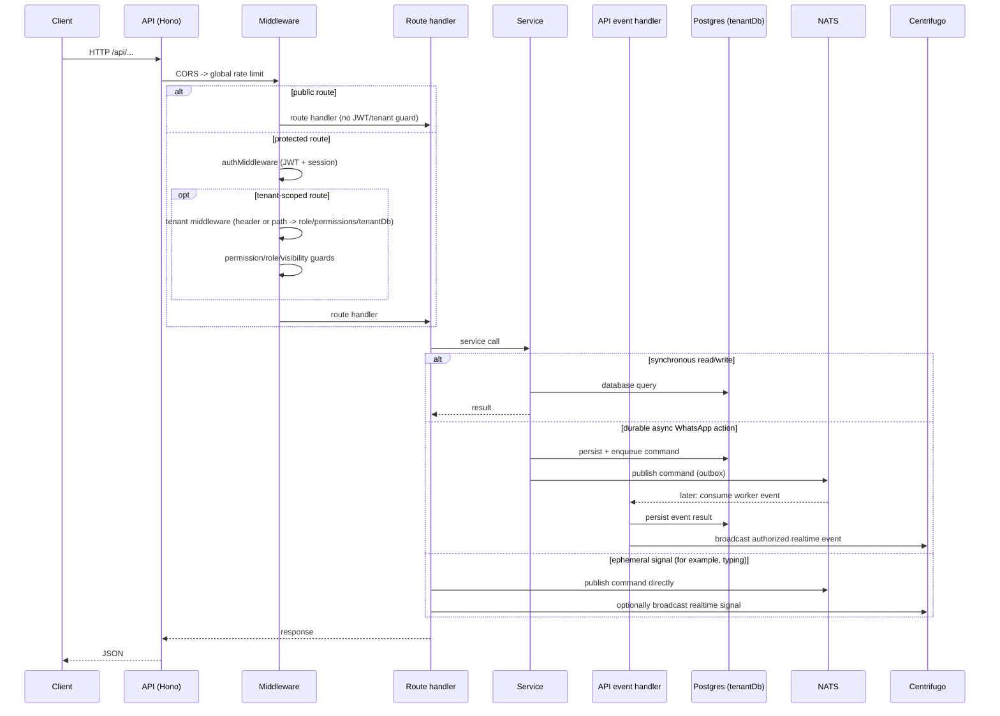

# WATeamInbox API Documentation

Detailed, group-by-group API reference for `apps/api` (the OSS API service). Every group file lists its endpoints with access controls and includes Mermaid sequence diagrams for the important flows.

> Generated from `apps/api/src/routes`. All paths are served under the `/api` base path.

## Architecture at a glance

The API is a [Hono](https://hono.dev) app. Logging, CORS, and the configured global rate limiter run at the app level; authentication, tenant resolution, authorization, persistence, and messaging depend on the endpoint. Each group table lists the applicable route guards.

### Request context

- **Auth:** `Authorization: Bearer <access-token>` (JWT). Refresh tokens live in an HTTP-only cookie.
- **Tenant:** Most tenant routes use `X-Company-ID: <workspace-uuid>`; company-resource routes resolve `:id` instead. The tenant middleware resolves membership, role, permissions, and opens the per-tenant `tenant_<uuid>` schema connection.
- **Permissions:** feature-based (`can_send_messages`, `can_manage_connections`, ...) plus role hierarchy (owner > admin > member).

### Async command path

Durable, state-changing WhatsApp actions persist state and enqueue a command in the **command outbox**, which publishes to **NATS (JetStream)**. A connection's **WhatsApp worker** consumes its command subject directly, performs the action, and publishes events back. The API event handlers consume those events, persist results, then broadcast through **Centrifugo**. Ephemeral signals such as typing may publish directly instead of using the outbox. The **orchestrator** manages worker lifecycle (spawn/kill); it does not forward ordinary connection commands.

## Groups

| Group | File | Endpoints |
|-------|------|-----------|
| Auth | [`auth.md`](auth.md) | 14 |
| Companies (Workspaces) | [`companies.md`](companies.md) | 22 |
| Invitations (token acceptance) | [`invitations.md`](invitations.md) | 2 |
| Contacts | [`contacts.md`](contacts.md) | 20 |
| Conversations | [`conversations.md`](conversations.md) | 14 |
| Messages | [`messages.md`](messages.md) | 15 |
| Groups | [`groups.md`](groups.md) | 19 |
| WhatsApp Connections & Status | [`whatsapp.md`](whatsapp.md) | 20 |
| Notifications | [`notifications.md`](notifications.md) | 15 |
| Analytics | [`analytics.md`](analytics.md) | 13 |
| Bulk Broadcast Jobs | [`bulk-jobs.md`](bulk-jobs.md) | 7 |
| Catalogs | [`catalogs.md`](catalogs.md) | 9 |
| Labels | [`labels.md`](labels.md) | 10 |
| Tags | [`tags.md`](tags.md) | 4 |
| Quick Replies | [`quick-replies.md`](quick-replies.md) | 6 |
| Search | [`search.md`](search.md) | 5 |
| Status (Stories) | [`status.md`](status.md) | 6 |
| Audit | [`audit.md`](audit.md) | 4 |
| Export | [`export.md`](export.md) | 5 |
| Media | [`media.md`](media.md) | 3 |
| Actions (realtime REST) | [`actions.md`](actions.md) | 3 |
| Realtime (Centrifugo token) | [`realtime.md`](realtime.md) | 1 |
| Health | [`health.md`](health.md) | 3 |
| Feedback | [`feedback.md`](feedback.md) | 1 |
| Debug (NATS) | [`debug.md`](debug.md) | 5 |
| Root (`/`) | see below | 1 |

## Root

| Method | Path | Access | Description |
|--------|------|--------|-------------|
| GET | `/` | Public | API service info (name and version) |
