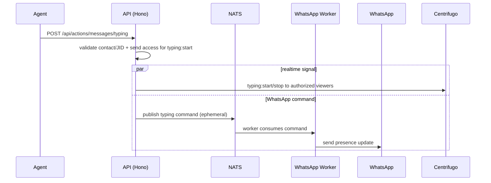

# Actions (realtime REST) API

> Base path: `/api/actions` · 2 endpoints

Lightweight realtime REST actions. Read is a visibility-checked Centrifugo signal only; it does not persist read state or command WhatsApp. Typing broadcasts to authorized realtime viewers while publishing the worker/WhatsApp command in parallel.

## Endpoints

**Methods:** GET 0 · POST 2 · DELETE 0 · PATCH 0 · PUT 0

| Method | Path | Access | Description |
|--------|------|--------|-------------|
| POST | `/actions/messages/read` | Authenticated · Tenant context · Contact visibility | Broadcast a visibility-checked realtime read signal only |
| POST | `/actions/messages/typing` | Authenticated · Tenant context · `can_send_messages` · Send access for typing start | Broadcast realtime typing and publish a WhatsApp typing command in parallel |

## Flows

### Typing indicator

