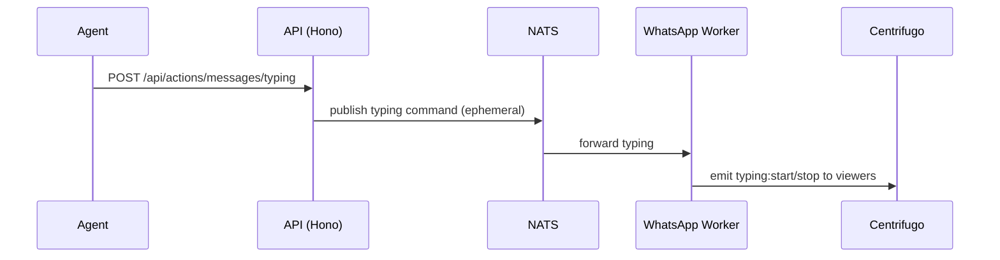

# Actions (realtime REST) API

> Base path: `/api/actions` · 3 endpoints

Lightweight REST actions mirrored to realtime: mark read, send, and typing indicators. `typing` emits an ephemeral signal to the other side.

## Endpoints

**Methods:** GET 0 · POST 3 · DELETE 0 · PATCH 0 · PUT 0

| Method | Path | Access | Description |
|--------|------|--------|-------------|
| POST | `/actions/messages/read` | — | Mark messages as read |
| POST | `/actions/messages/send` | `can_send_messages` · Legacy removed | Send a WhatsApp message |
| POST | `/actions/messages/typing` | `can_send_messages` | Send typing indicator |

## Flows

### Typing indicator

