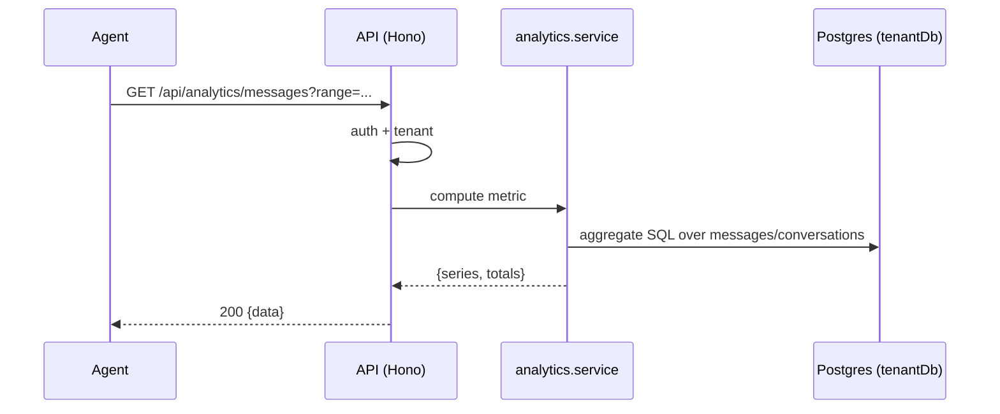

# Analytics API

> Base path: `/api/analytics` · 13 endpoints

Read-only aggregate metrics: messages, response times, SLA breaches, engagement, team activity, and dashboard totals. All queries run against the tenant schema; dashboard access is gated by `can_view_dashboard`.

## Endpoints

**Methods:** GET 13 · POST 0 · DELETE 0 · PATCH 0 · PUT 0

| Method | Path | Access | Description |
|--------|------|--------|-------------|
| GET | `/analytics/contacts` | Rate limited | Get contact statistics |
| GET | `/analytics/contacts/trend` | Rate limited | Get new contacts trend over time |
| GET | `/analytics/dashboard` | Rate limited | Get dashboard overview stats |
| GET | `/analytics/engagement` | Rate limited | Get customer engagement metrics |
| GET | `/analytics/engagement/trend` | Rate limited | Get engagement trend over time |
| GET | `/analytics/hourly` | Rate limited | Get hourly message distribution |
| GET | `/analytics/message-types` | Rate limited | Get message type distribution |
| GET | `/analytics/messages` | Rate limited | Get message statistics over time |
| GET | `/analytics/response-time` | Rate limited | Get response time statistics |
| GET | `/analytics/response-time/team` | Rate limited | Get response time stats by team member |
| GET | `/analytics/response-time/trend` | Rate limited | Get response time trend over time |
| GET | `/analytics/sla-breaches` | Rate limited | Get conversations that exceeded SLA |
| GET | `/analytics/team` | Rate limited | Get team activity statistics |

## Flows

### Analytics query

