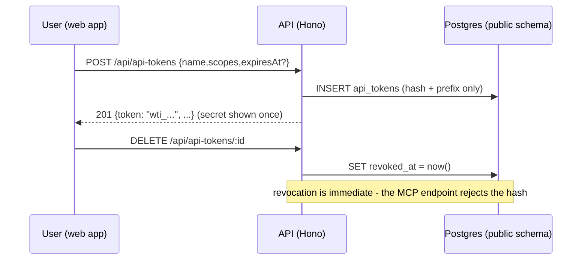

# API tokens API

> Base path: `/api/api-tokens` · 3 endpoints

Personal, revocable API tokens (`wti_...`) that authenticate the MCP endpoint. Managed with the normal web session; the raw secret is returned exactly once at creation and only its SHA-256 hash is stored. Members manage their own tokens; admins/owners can list and revoke any workspace token (`?all=true`).

## Endpoints

**Methods:** GET 1 · POST 1 · DELETE 1 · PATCH 0 · PUT 0

| Method | Path | Access | Description |
|--------|------|--------|-------------|
| GET | `/api-tokens` | Authenticated · Tenant context | List own tokens; ?all=true lists all workspace tokens (admin/owner) |
| POST | `/api-tokens` | Authenticated · Tenant context | Create an API token; the secret is returned only once |
| DELETE | `/api-tokens/:id` | Authenticated · Tenant context | Revoke a token (own; admins may revoke any) |

## Flows

### Token lifecycle

