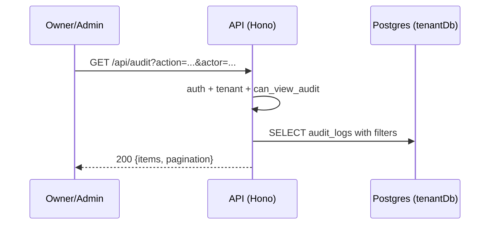

# Audit API

> Base path: `/api/audit` · 4 endpoints

Audit log for sensitive workspace actions. Read-only; requires `can_view_audit` (owner/admin). Supports export of the log.

## Endpoints

**Methods:** GET 4 · POST 0 · DELETE 0 · PATCH 0 · PUT 0

| Method | Path | Access | Description |
|--------|------|--------|-------------|
| GET | `/audit/` | — | Get audit logs with optional filters |
| GET | `/audit/actions` | — | Get list of available action types |
| GET | `/audit/actors` | — | Actors available to audit filters. |
| GET | `/audit/export` | `can_export` | Export audit logs as CSV |

## Flows

### Audit query

