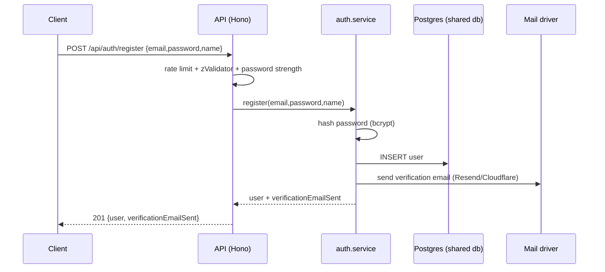
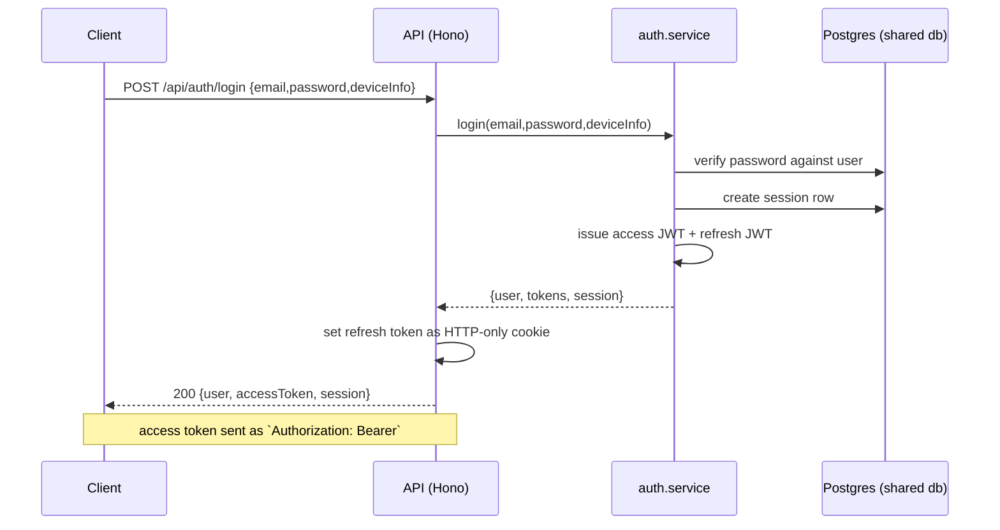
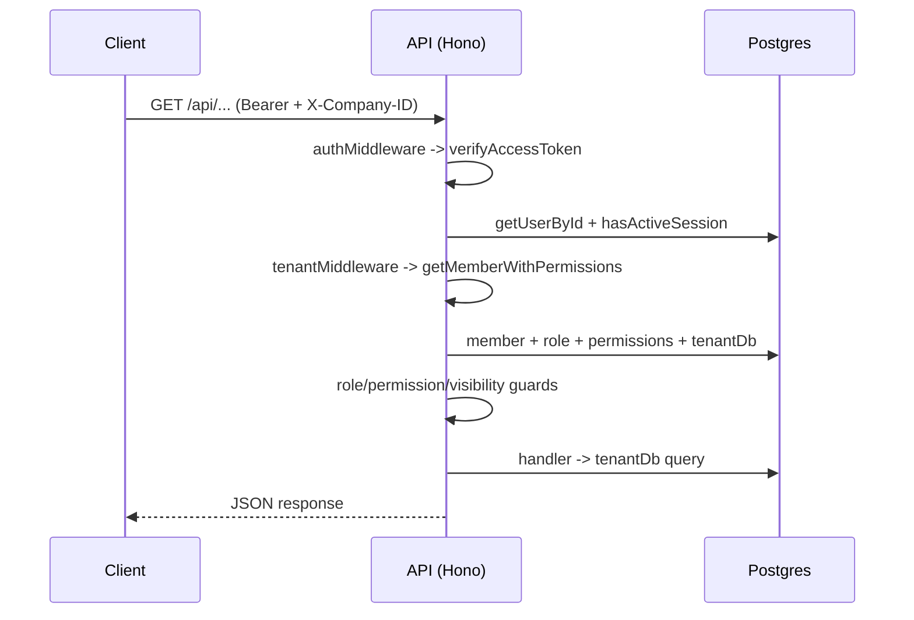

# Auth API

> Base path: `/api/auth` · 14 endpoints

Authentication and account lifecycle: registration, login, session refresh/revocation, email verification, and password reset. These routes are **public** (no tenant context); a few (`/auth/me`, `/auth/sessions`, `/auth/logout`, `/auth/change-password`) require a valid access token.

## Endpoints

**Methods:** GET 2 · POST 9 · DELETE 2 · PATCH 1 · PUT 0

| Method | Path | Access | Description |
|--------|------|--------|-------------|
| POST | `/auth/change-password` | Authenticated | Change the current user's password and revoke other device sessions. |
| POST | `/auth/forgot-password` | Public · Rate limited | Request a password reset email |
| POST | `/auth/login` | Public · Rate limited | Login with email and password |
| POST | `/auth/logout` | Authenticated | Logout the current session |
| GET | `/auth/me` | Authenticated | Get current user information |
| PATCH | `/auth/me` | Authenticated | Update the current user's name, email, or profile image. |
| POST | `/auth/refresh` | Public · Rate limited | Refresh access token using refresh token |
| POST | `/auth/register` | Public · Rate limited | Register a new user with email and password |
| POST | `/auth/resend-verification` | Public · Rate limited | Reissue a verification link after checking the account password. |
| POST | `/auth/reset-password` | Public | Reset password with token |
| DELETE | `/auth/sessions` | Authenticated | Logout all sessions except the current one |
| GET | `/auth/sessions` | Authenticated | List all active sessions for the current user |
| DELETE | `/auth/sessions/:id` | Authenticated | Delete a specific session |
| POST | `/auth/verify-email` | Public | Verify email with token |

## Flows

### Registration

### Login & session

### Authenticated request (middleware)

