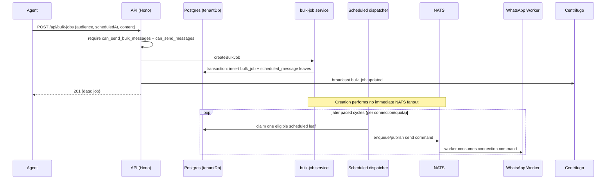

# Bulk Broadcast Jobs API

> Base path: `/api/bulk-jobs` · 7 endpoints

Bulk broadcast campaigns: preview, create, schedule, cancel, and track recipients. Send surfaces require both `can_send_bulk_messages` and `can_send_messages`. Creation atomically materializes scheduled-message leaves; a later paced, per-connection dispatcher sends them.

## Endpoints

**Methods:** GET 3 · POST 3 · DELETE 0 · PATCH 1 · PUT 0

| Method | Path | Access | Description |
|--------|------|--------|-------------|
| GET | `/bulk-jobs` | Authenticated · Tenant context · `can_send_bulk_messages` | List jobs (newest first) with derived progress. |
| POST | `/bulk-jobs` | Authenticated · Tenant context · `can_send_messages` · `can_send_bulk_messages` · Rate limited | Create a job and snapshot its recipients. Idempotent via idempotencyKey; drift between the previewed and current audience returns 409 with a fresh preview for re-confirmation. |
| GET | `/bulk-jobs/:id` | Authenticated · Tenant context · `can_send_bulk_messages` | Job detail with derived progress. |
| POST | `/bulk-jobs/:id/cancel` | Authenticated · Tenant context · `can_send_messages` · `can_send_bulk_messages` · Rate limited | Cancel a job's unsent recipients. Leaves already claimed by a dispatcher finish under their fencing token. |
| GET | `/bulk-jobs/:id/recipients` | Authenticated · Tenant context · `can_send_bulk_messages` | Paginated per-recipient outcomes. |
| PATCH | `/bulk-jobs/:id/schedule` | Authenticated · Tenant context · `can_send_messages` · `can_send_bulk_messages` · Rate limited | Move a truly not-started broadcast. The service updates the parent and already-materialized leaves in one guarded transaction; dispatch/cancel races return a controlled conflict. |
| POST | `/bulk-jobs/preview` | Authenticated · Tenant context · `can_send_messages` · `can_send_bulk_messages` · Rate limited | Resolve the audience an exact job would target. |

## Flows

### Bulk job lifecycle

