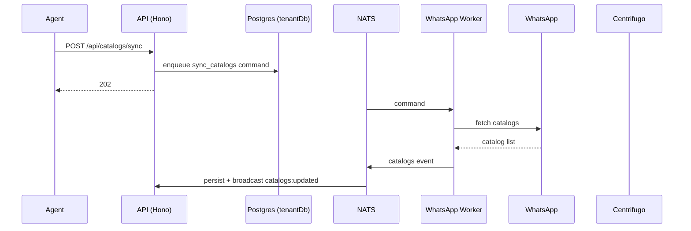

# Catalogs API

> Base path: `/api/catalogs` · 9 endpoints

WhatsApp Commerce catalogs: list catalogs and products, sync from WhatsApp, and toggle product visibility. Sync is asynchronous via the worker.

## Endpoints

**Methods:** GET 4 · POST 4 · DELETE 0 · PATCH 1 · PUT 0

| Method | Path | Access | Description |
|--------|------|--------|-------------|
| GET | `/catalogs/` | — | List all WhatsApp Business catalogs |
| GET | `/catalogs/:catalogId` | — | Get a specific catalog |
| POST | `/catalogs/:catalogId/archive` | — | Archive a catalog |
| GET | `/catalogs/:catalogId/products` | — | Get products for a catalog |
| PATCH | `/catalogs/:catalogId/products/:productId/visibility` | — | Update product visibility |
| POST | `/catalogs/:catalogId/restore` | — | Restore an archived catalog |
| POST | `/catalogs/:catalogId/sync-products` | — | Trigger a sync of products for a specific catalog |
| GET | `/catalogs/status` | — | Get catalog sync status summary |
| POST | `/catalogs/sync` | — | Trigger a sync of catalogs from WhatsApp Business This sends a command to the Go service to fetch catalogs |

## Flows

### Sync catalog

