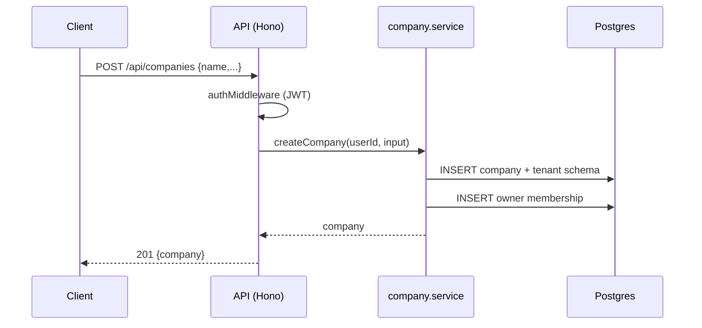
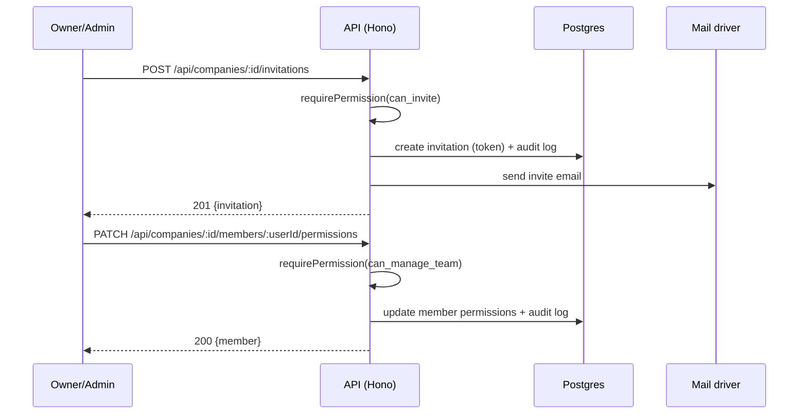

# Companies (Workspaces) API

> Base path: `/api/companies` · 22 endpoints

Workspace management: company CRUD, members, invitations, member permissions, SLA policy, and ownership transfer. All routes require a valid JWT and tenant context (`X-Company-ID`). Admin/owner-only actions are annotated per endpoint.

## Endpoints

**Methods:** GET 9 · POST 7 · DELETE 3 · PATCH 3 · PUT 0

| Method | Path | Access | Description |
|--------|------|--------|-------------|
| GET | `/companies/` | — | List companies the user belongs to |
| POST | `/companies/` | — | Create a new company |
| GET | `/companies/:id` | — | Get company details |
| PATCH | `/companies/:id` | — | Update company |
| DELETE | `/companies/:id` | — | Delete company (soft delete) |
| GET | `/companies/:id/invitations` | `can_invite` | List pending invitations |
| POST | `/companies/:id/invitations` | `can_invite` | Create invitation |
| DELETE | `/companies/:id/invitations/:invitationId` | `can_invite` | Cancel invitation |
| POST | `/companies/:id/invitations/:invitationId/resend` | `can_invite` | Resend invitation |
| POST | `/companies/:id/leave` | — | Leave a workspace as a non-owner member. |
| GET | `/companies/:id/member-identities` | — | identities Minimal teammate identity directory used by shared-inbox message attribution. Every active workspace member may read it; emails, roles, and permissions are intentionally excluded. |
| GET | `/companies/:id/members` | `can_manage_team` | List company members |
| PATCH | `/companies/:id/members/:userId` | `can_manage_team` | Update member role |
| DELETE | `/companies/:id/members/:userId` | `can_manage_team` | Remove member from company |
| GET | `/companies/:id/members/:userId/permissions` | `can_manage_team` | Get member's effective permissions |
| PATCH | `/companies/:id/members/:userId/permissions` | — | Update member's custom permissions |
| POST | `/companies/:id/members/:userId/permissions/reset` | — | Reset member's permissions to role defaults |
| GET | `/companies/:id/permissions` | — | List all available permissions |
| GET | `/companies/:id/sla-policy` | — | Get the SLA policy currently in effect. Any member can view it (read-only summary is fine for non-admins). |
| POST | `/companies/:id/sla-policy` | — | Create a new (immediately-active) SLA policy version. Admin/owner only. Never overwrites a prior version. |
| GET | `/companies/:id/sla-policy/history` | — | Full, immutable version history. Any member can view it. |
| POST | `/companies/:id/transfer-ownership` | — | Transfer ownership to another member. |

## Flows

### Create company & become owner

### Invite & update member

