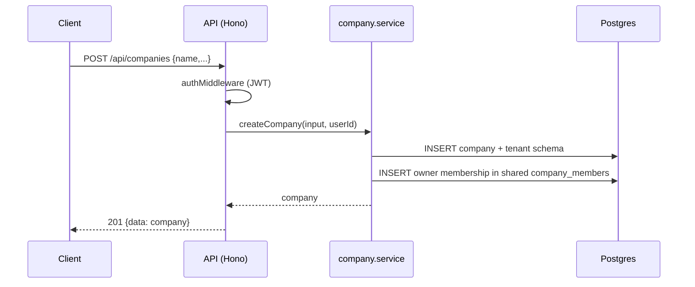
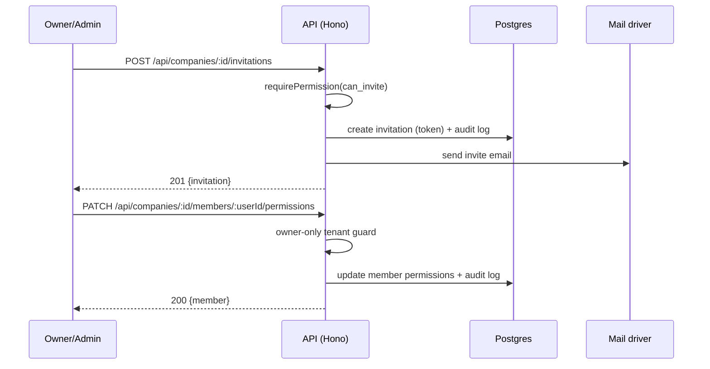

# Companies (Workspaces) API

> Base path: `/api/companies` · 22 endpoints

Workspace management: company CRUD, members, invitations, member permissions, SLA policy, and ownership transfer. Listing and creating companies require only a valid JWT; routes for a specific `:id` resolve tenant membership with `tenantFromParam`. `PATCH /:id` requires Admin access generally, but changing `status` is conditionally owner-only.

## Endpoints

**Methods:** GET 9 · POST 7 · DELETE 3 · PATCH 3 · PUT 0

| Method | Path | Access | Description |
|--------|------|--------|-------------|
| GET | `/companies` | Authenticated | List companies the user belongs to |
| POST | `/companies` | Authenticated | Create a new company |
| DELETE | `/companies/:id` | Authenticated · Tenant context · Owner role | Delete company (soft delete) |
| GET | `/companies/:id` | Authenticated · Tenant context | Get company details |
| PATCH | `/companies/:id` | Authenticated · Tenant context · Admin role · Owner role when changing status | Update company |
| GET | `/companies/:id/invitations` | Authenticated · Tenant context · `can_invite` | List pending invitations |
| POST | `/companies/:id/invitations` | Authenticated · Tenant context · `can_invite` | Create invitation |
| DELETE | `/companies/:id/invitations/:invitationId` | Authenticated · Tenant context · `can_invite` | Cancel invitation |
| POST | `/companies/:id/invitations/:invitationId/resend` | Authenticated · Tenant context · `can_invite` | Resend invitation |
| POST | `/companies/:id/leave` | Authenticated · Tenant context · Non-owner only | Leave a workspace as a non-owner member. |
| GET | `/companies/:id/member-identities` | Authenticated · Tenant context | Minimal teammate identity directory used by shared-inbox message attribution. Every active workspace member may read it; emails, roles, and permissions are intentionally excluded. |
| GET | `/companies/:id/members` | Authenticated · Tenant context · `can_manage_team` | List company members |
| DELETE | `/companies/:id/members/:userId` | Authenticated · Tenant context · `can_manage_team` · Actor must outrank target | Remove member from company |
| PATCH | `/companies/:id/members/:userId` | Authenticated · Tenant context · `can_manage_team` · Actor must outrank target | Update member role |
| GET | `/companies/:id/members/:userId/permissions` | Authenticated · Tenant context · `can_manage_team` | Get member's effective permissions |
| PATCH | `/companies/:id/members/:userId/permissions` | Authenticated · Tenant context · Owner role | Update member's custom permissions |
| POST | `/companies/:id/members/:userId/permissions/reset` | Authenticated · Tenant context · Owner role | Reset member's permissions to role defaults |
| GET | `/companies/:id/permissions` | Authenticated · Tenant context | List all available permissions |
| GET | `/companies/:id/sla-policy` | Authenticated · Tenant context | Get the SLA policy currently in effect. Any member can view it (read-only summary is fine for non-admins). |
| POST | `/companies/:id/sla-policy` | Authenticated · Tenant context · Admin role | Create a new (immediately-active) SLA policy version. Admin/owner only. Never overwrites a prior version. |
| GET | `/companies/:id/sla-policy/history` | Authenticated · Tenant context | Full, immutable version history. Any member can view it. |
| POST | `/companies/:id/transfer-ownership` | Authenticated · Tenant context · Owner role | Transfer ownership to another member. |

## Flows

### Create company & become owner

### Invite & update member

