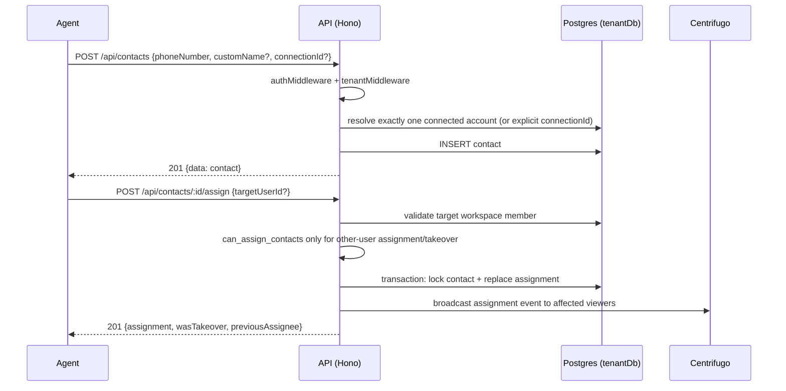

# Contacts API

> Base path: `/api/contacts` · 20 endpoints

Contact (customer) management: CRUD, assignment, notes, tags, and CSV import. Notes and assignments carry permission/visibility semantics; see the access column per endpoint.

## Endpoints

**Methods:** GET 6 · POST 7 · DELETE 4 · PATCH 1 · PUT 2

| Method | Path | Access | Description |
|--------|------|--------|-------------|
| GET | `/contacts` | Authenticated · Tenant context · Contact visibility (result-filtered) | List all contacts |
| POST | `/contacts` | Authenticated · Tenant context | Create a new contact manually by phone number |
| GET | `/contacts/:id` | Authenticated · Tenant context · Contact visibility | Get a specific contact |
| PATCH | `/contacts/:id` | Authenticated · Tenant context · Contact visibility | Update a contact Supports: customName, notesShared, isBlocked |
| DELETE | `/contacts/:id/assign` | Authenticated · Tenant context · `can_assign_contacts` | Unassign contact |
| POST | `/contacts/:id/assign` | Authenticated · Tenant context · Conditional `can_assign_contacts` (other-user assignment or takeover) | Assign contact to a user (or self) |
| GET | `/contacts/:id/assignments` | Authenticated · Tenant context · Contact visibility | Get assignment history for a contact |
| GET | `/contacts/:id/notes/private` | Authenticated · Tenant context · Contact visibility | Get private notes for a contact (user's own notes only) |
| POST | `/contacts/:id/notes/private` | Authenticated · Tenant context · Contact visibility | Create a new private note |
| DELETE | `/contacts/:id/notes/private/:noteId` | Authenticated · Tenant context · Contact visibility | Delete a specific private note |
| PUT | `/contacts/:id/notes/private/:noteId` | Authenticated · Tenant context · Contact visibility | Update a specific private note |
| GET | `/contacts/:id/notes/shared` | Authenticated · Tenant context · Contact visibility | Get shared notes for a contact (paginated) |
| POST | `/contacts/:id/notes/shared` | Authenticated · Tenant context · Contact visibility | Create a new shared note |
| DELETE | `/contacts/:id/notes/shared/:noteId` | Authenticated · Tenant context · Contact visibility · Author only | Delete a shared note (author only) |
| PUT | `/contacts/:id/notes/shared/:noteId` | Authenticated · Tenant context · Contact visibility · Author only | Update a shared note (author only) |
| POST | `/contacts/:id/tags` | Authenticated · Tenant context · Contact visibility | Add a tag to a contact |
| DELETE | `/contacts/:id/tags/:tagId` | Authenticated · Tenant context · Contact visibility | Remove a tag from a contact |
| POST | `/contacts/import` | Authenticated · Tenant context · Admin role · Rate limited | Import contacts from CSV Accepts: multipart/form-data with file field, or JSON with csvContent field |
| POST | `/contacts/import/preview` | Authenticated · Tenant context · Rate limited | Preview import without saving |
| GET | `/contacts/import/template` | Authenticated · Tenant context | Download CSV template for import |

## Flows

### Create & assign contact



### CSV import

```mermaid
sequenceDiagram
    participant U as Agent
    participant A as API (Hono)
    participant S as import service
    participant D as Postgres (tenantDb)
    U->>A: POST /api/contacts/import (multipart CSV)
    A->>A: Admin role + rate limit; parse and validate CSV
    A->>D: resolve explicit/sole connected account
    A->>S: importContacts (upsert rows and optional tags)
    S-->>A: summary + per-row results
    A-->>U: 201 {summary, results, connection}
```

### First outgoing chat acknowledgment (inbox)

The inbox checks `GET /contacts/:id/first-chat-acknowledgment` when the user
attempts to send or schedule their first message, including attachments. Opening
or typing in a chat does not prompt. The response includes `required`, `notice`,
`noticeVersion`, and `guidanceUrl`. Groups and contacts with existing message
history (incoming or outgoing) are exempt. A previous acknowledgment applies to
this contact across teammates and sessions.

When required, the user must check “I understand and will follow these messaging guidelines”
and confirm before the pending action continues. Cancel or a failed request
preserves the draft. The web client posts `{ checked: true, noticeVersion }` to
`POST /contacts/:id/first-chat-acknowledgment`; false/missing acknowledgments and
outdated notice versions are rejected. Both endpoints enforce tenant and contact
visibility; POST also requires message-send permission.

Acceptance creates `contact.first_chat_acknowledged` in the tenant's existing
`audit_logs` table, recording the authenticated user, contact, server timestamp,
checkbox value, exact notice/version, guidance URL, and client IP. Concurrent
acceptances serialize under a contact-row lock and create one record. Audit
failure prevents the inbox from continuing. No migration is required.

This is an inbox acknowledgment, not evidence of recipient consent or an account
safety guarantee. Direct API/MCP sends, forwards, and bulk automation do not gain
a new acknowledgment requirement. Saving acceptance and sending the message are
separate operations: acceptance remains recorded if subsequent delivery fails.
