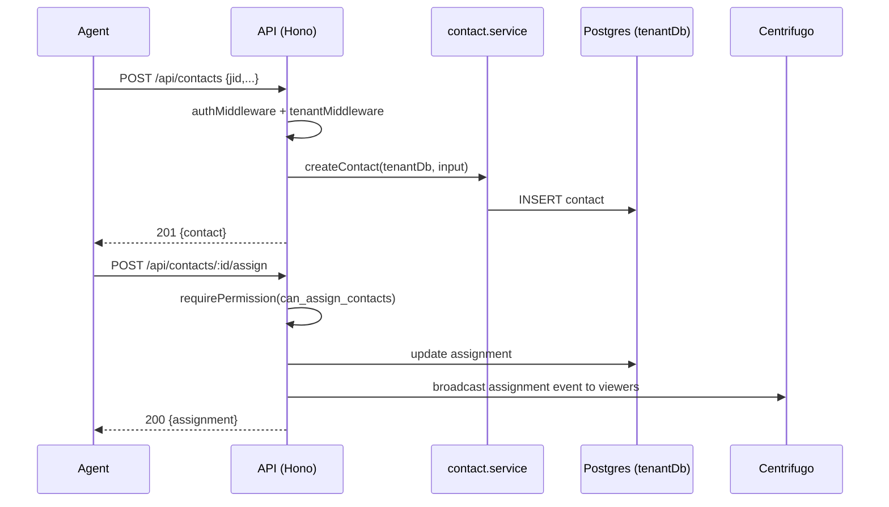
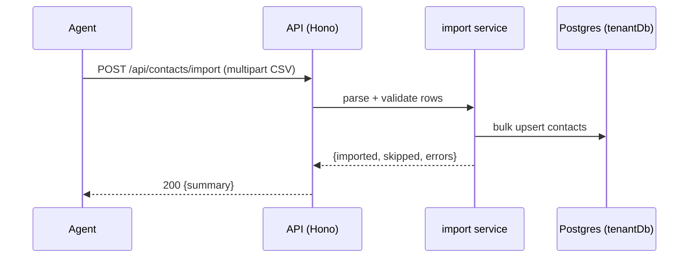

# Contacts API

> Base path: `/api/contacts` · 20 endpoints

Contact (customer) management: CRUD, assignment, notes, tags, and CSV import. Notes and assignments carry permission/visibility semantics; see the access column per endpoint.

## Endpoints

**Methods:** GET 6 · POST 7 · DELETE 4 · PATCH 1 · PUT 2

| Method | Path | Access | Description |
|--------|------|--------|-------------|
| GET | `/contacts/` | — | List all contacts |
| POST | `/contacts/` | — | Create a new contact manually by phone number |
| GET | `/contacts/:id` | — | Get a specific contact |
| PATCH | `/contacts/:id` | — | Update a contact Supports: customName, notesShared, isBlocked |
| POST | `/contacts/:id/assign` | — | Assign contact to a user (or self) |
| DELETE | `/contacts/:id/assign` | `can_assign_contacts` | Unassign contact |
| GET | `/contacts/:id/assignments` | Contact visibility | Get assignment history for a contact |
| GET | `/contacts/:id/notes/private` | — | Get private notes for a contact (user's own notes only) |
| POST | `/contacts/:id/notes/private` | — | Create a new private note |
| PUT | `/contacts/:id/notes/private/:noteId` | — | Update a specific private note |
| DELETE | `/contacts/:id/notes/private/:noteId` | — | Delete a specific private note |
| GET | `/contacts/:id/notes/shared` | — | Get shared notes for a contact (paginated) |
| POST | `/contacts/:id/notes/shared` | — | Create a new shared note |
| PUT | `/contacts/:id/notes/shared/:noteId` | — | Update a shared note (author only) |
| DELETE | `/contacts/:id/notes/shared/:noteId` | — | Delete a shared note (author only) |
| POST | `/contacts/:id/tags` | — | Add a tag to a contact |
| DELETE | `/contacts/:id/tags/:tagId` | — | Remove a tag from a contact |
| POST | `/contacts/import` | Admin role · Rate limited | Import contacts from CSV Accepts: multipart/form-data with file field, or JSON with csvContent field |
| POST | `/contacts/import/preview` | Rate limited | Preview import without saving |
| GET | `/contacts/import/template` | — | Download CSV template for import |

## Flows

### Create & assign contact

### CSV import

