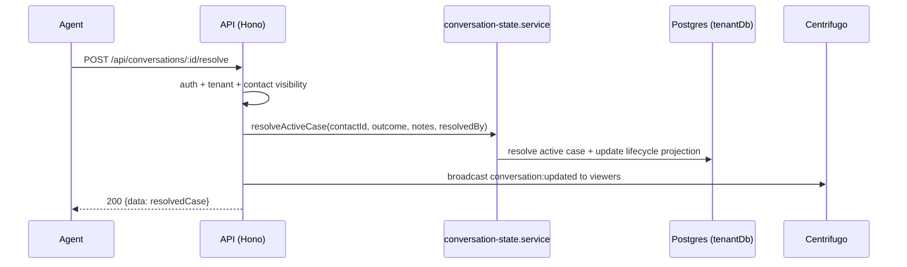

# Conversations API

> Base path: `/api/conversations` · 14 endpoints

Conversation state transitions and message reads for a contact, plus resolution/SLA analytics. State transitions update the conversation case and are recorded for SLA tracking.

## Endpoints

**Methods:** GET 6 · POST 8 · DELETE 0 · PATCH 0 · PUT 0

| Method | Path | Access | Description |
|--------|------|--------|-------------|
| POST | `/conversations/:id/history` | Authenticated · Tenant context · Contact visibility | Request the next remote history page from the primary WhatsApp device after local database pages are exhausted. |
| GET | `/conversations/:id/messages` | Authenticated · Tenant context · Contact visibility | Get messages for a conversation/contact |
| POST | `/conversations/:id/messages` | Authenticated · Tenant context · Contact visibility · `can_send_messages` | Send a new message |
| POST | `/conversations/:id/open` | Authenticated · Tenant context · Contact visibility · `can_send_messages` | Manually open a conversation that has never had a case. Reason is optional (there's nothing prior to justify reopening). If a prior case actually exists, this returns a 409 instead of transparently reopening - the caller's view is stale and must refetch and use `/reopen`. |
| POST | `/conversations/:id/pending` | Authenticated · Tenant context · Contact visibility · `can_send_messages` | Mark the contact's active case pending. Stays within the same case; does not pause either SLA clock. |
| POST | `/conversations/:id/read` | Authenticated · Tenant context · Contact visibility | Mark a conversation as read (reset unread count) |
| POST | `/conversations/:id/reopen` | Authenticated · Tenant context · Contact visibility · `can_send_messages` | Manually reopen a resolved conversation as a brand-new case (the previous case is preserved, never mutated). |
| POST | `/conversations/:id/resolve` | Authenticated · Tenant context · Contact visibility · `can_send_messages` | Resolve the contact's active case with a required close outcome (and notes, if the outcome is `other`). |
| POST | `/conversations/:id/resume` | Authenticated · Tenant context · Contact visibility · `can_send_messages` | Resume a pending case back to open. The SAME case (never a new one) - `opened_at` and both SLA clocks are unaffected, since `pending` never paused them. Distinct from `/open` (which always starts a brand-new case for a contact with none active). |
| GET | `/conversations/:id/state` | Authenticated · Tenant context · Contact visibility | Get the conversation lifecycle state (the current projection plus the active case, if any) for a contact. `hasCaseHistory` tells the UI whether Open (no prior case) or Reopen (a prior, resolved case exists) is the correct label/flow to offer for a resolved conversation. |
| GET | `/conversations/stats/resolution` | Authenticated · Tenant context · Contact visibility | Case-cycle resolution statistics (replaces the old mutable-state resolution stats). |
| GET | `/conversations/stats/resolution-breaches` | Authenticated · Tenant context · Contact visibility | Currently overdue active cases (resolution-SLA work queue), worst-first. |
| GET | `/conversations/stats/resolution-team` | Authenticated · Tenant context · Contact visibility | Resolution attribution by team member (who resolved what, and how fast). |
| GET | `/conversations/stats/resolution-trend` | Authenticated · Tenant context · Contact visibility | Case resolution trend over time |

## Flows

### Resolve conversation (state + SLA)

