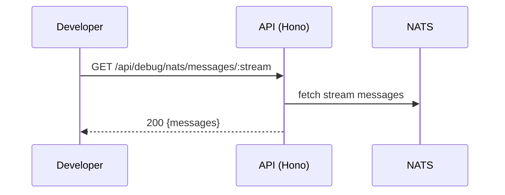

# Debug (NATS) API

> Base path: `/api/debug` · 5 endpoints

Development-only NATS inspection endpoints (consumers, messages, trace). Not enabled in production.

## Endpoints

**Methods:** GET 5 · POST 0 · DELETE 0 · PATCH 0 · PUT 0

| Method | Path | Access | Description |
|--------|------|--------|-------------|
| GET | `/debug/nats/consumers/:stream` | — | stream Get consumer info for a stream |
| GET | `/debug/nats/help` | — | Shows available debugging commands and endpoints |
| GET | `/debug/nats/messages/:stream` | — | stream Get recent messages from a stream (for debugging) |
| GET | `/debug/nats/status` | — | Get NATS connection status and stream info |
| GET | `/debug/nats/trace/:correlationId` | — | correlationId Provides instructions for tracing a correlation ID |

## Flows

### NATS inspection

