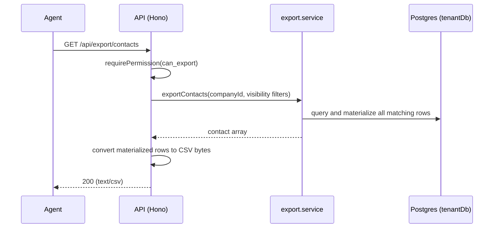

# Export API

> Base path: `/api/export` · 5 endpoints

Data export: contacts, messages, full workspace, single conversation, and bulk exports. Requires `can_export`. Export queries materialize rows in memory before JSON serialization or CSV generation; they do not stream database rows incrementally.

## Endpoints

**Methods:** GET 4 · POST 1 · DELETE 0 · PATCH 0 · PUT 0

| Method | Path | Access | Description |
|--------|------|--------|-------------|
| POST | `/export/bulk` | Authenticated · Tenant context · `can_export` · Rate limited · Contact visibility (result-filtered) | Bulk export with custom filters |
| GET | `/export/contacts` | Authenticated · Tenant context · `can_export` · Rate limited · Contact visibility (result-filtered) | Export contacts |
| GET | `/export/conversation/:contactId` | Authenticated · Tenant context · `can_export` · Contact visibility · Rate limited | Export conversation for a specific contact |
| GET | `/export/full` | Authenticated · Tenant context · `can_export` · `can_view_all_chats` · Rate limited | Full backup as ZIP file |
| GET | `/export/messages` | Authenticated · Tenant context · `can_export` · Rate limited · Contact visibility (result-filtered) | Export messages |

## Flows

### Export flow

