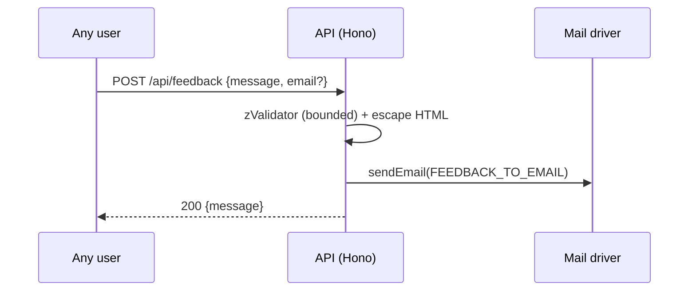

# Feedback API

> Base path: `/api/feedback` · 1 endpoints

Public feedback submission. Unauthenticated, body-bounded, and emailed to the address configured by `FEEDBACK_TO_EMAIL`.

## Endpoints

**Methods:** GET 0 · POST 1 · DELETE 0 · PATCH 0 · PUT 0

| Method | Path | Access | Description |
|--------|------|--------|-------------|
| POST | `/feedback` | Public | Submit feedback Public endpoint, no authentication required |

## Flows

### Submit feedback

