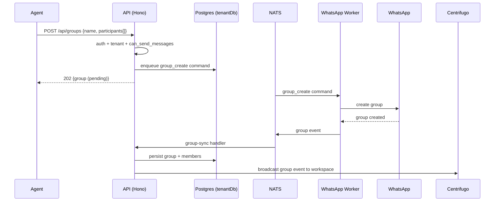
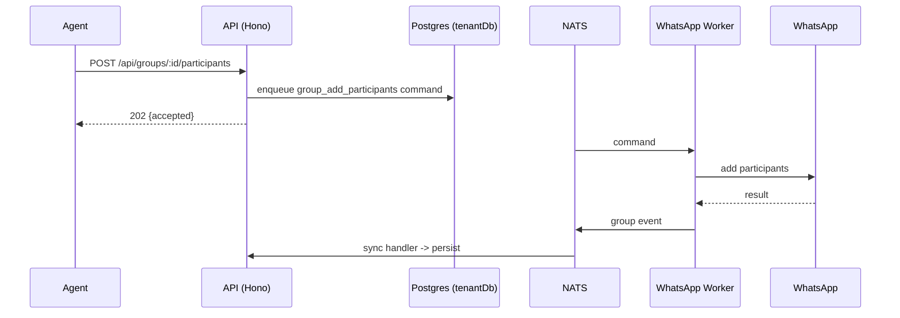

# Groups API

> Base path: `/api/groups` · 19 endpoints

WhatsApp group administration: list/create/rename, participant add/remove/promote/demote, settings, invite links, join requests, leave, and sync. These are **asynchronous** commands to WhatsApp; results come back via group events. Every mutation requires `can_send_messages`.

## Endpoints

**Methods:** GET 4 · POST 12 · DELETE 1 · PATCH 2 · PUT 0

| Method | Path | Access | Description |
|--------|------|--------|-------------|
| GET | `/groups/` | — | List all groups |
| POST | `/groups/` | — | Create a WhatsApp group |
| GET | `/groups/:id` | — | Get a specific group with participants |
| PATCH | `/groups/:id` | — | Update the workspace-local group alias |
| GET | `/groups/:id/admin-status` | — | Whether the group's own account is a group admin |
| POST | `/groups/:id/invite-link` | — | Fetch or rotate the group's invite link |
| GET | `/groups/:id/join-requests` | — | Cached pending requests to join |
| POST | `/groups/:id/join-requests/decision` | — | Approve or reject pending join requests |
| POST | `/groups/:id/join-requests/refresh` | — | Re-read pending join requests from WhatsApp |
| POST | `/groups/:id/leave` | — | Leave the group |
| POST | `/groups/:id/participants` | — | Add members to the group |
| DELETE | `/groups/:id/participants/:participantJid` | — | Remove a single participant (deprecated; use `POST /groups/:id/participants/remove`) |
| POST | `/groups/:id/participants/:participantJid/demote` | — | Demote a single admin to member |
| POST | `/groups/:id/participants/:participantJid/promote` | — | Promote a single member to admin |
| POST | `/groups/:id/participants/demote` | — | Demote admins to regular members |
| POST | `/groups/:id/participants/promote` | — | Promote members to admin |
| POST | `/groups/:id/participants/remove` | — | Remove members from the group |
| PATCH | `/groups/:id/settings` | — | Update the group's profile and permissions |
| POST | `/groups/:id/sync` | — | Re-read the group from WhatsApp |

## Flows

### Create group (async)

### Add participants (async)

