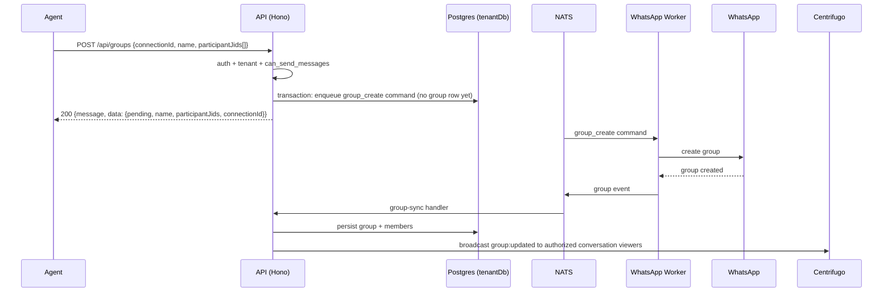
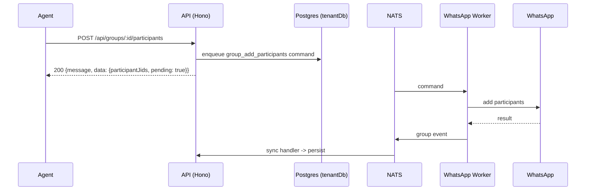

# Groups API

> Base path: `/api/groups` · 16 endpoints

WhatsApp group administration: list/create/rename, participant add/remove/promote/demote, settings, invite links, join requests, leave, and sync. WhatsApp-affecting mutations enqueue asynchronous commands and are persisted only after worker events; the group alias update is local and synchronous. Every mutation requires `can_send_messages`, and applicable administration handlers also verify the connected account is a group admin.

## Endpoints

**Methods:** GET 4 · POST 10 · DELETE 0 · PATCH 2 · PUT 0

| Method | Path | Access | Description |
|--------|------|--------|-------------|
| GET | `/groups` | Authenticated · Tenant context · Contact visibility (result-filtered) | List all groups |
| POST | `/groups` | Authenticated · Tenant context · `can_send_messages` | Request group creation; returns 200 with `{message, data: {pending, name, participantJids, connectionId}}` |
| GET | `/groups/:id` | Authenticated · Tenant context · Contact visibility | Get a specific group with participants |
| PATCH | `/groups/:id` | Authenticated · Tenant context · Contact visibility · `can_send_messages` | Update the workspace-local group alias |
| GET | `/groups/:id/admin-status` | Authenticated · Tenant context · Contact visibility | Whether the group's own account is a group admin |
| POST | `/groups/:id/invite-link` | Authenticated · Tenant context · Contact visibility · `can_send_messages` · WhatsApp group admin | Fetch or rotate the group's invite link |
| GET | `/groups/:id/join-requests` | Authenticated · Tenant context · Contact visibility · WhatsApp group admin | Cached pending requests to join |
| POST | `/groups/:id/join-requests/decision` | Authenticated · Tenant context · Contact visibility · `can_send_messages` · WhatsApp group admin | Approve or reject pending join requests |
| POST | `/groups/:id/join-requests/refresh` | Authenticated · Tenant context · Contact visibility · `can_send_messages` · WhatsApp group admin | Re-read pending join requests from WhatsApp |
| POST | `/groups/:id/leave` | Authenticated · Tenant context · Contact visibility · `can_send_messages` | Leave the group |
| POST | `/groups/:id/participants` | Authenticated · Tenant context · Contact visibility · `can_send_messages` · WhatsApp group admin | Request adding participants; returns 200 with `{message, data: {participantJids, pending: true}}` |
| POST | `/groups/:id/participants/demote` | Authenticated · Tenant context · Contact visibility · `can_send_messages` · WhatsApp group admin | Demote admins to regular members |
| POST | `/groups/:id/participants/promote` | Authenticated · Tenant context · Contact visibility · `can_send_messages` · WhatsApp group admin | Promote members to admin |
| POST | `/groups/:id/participants/remove` | Authenticated · Tenant context · Contact visibility · `can_send_messages` · WhatsApp group admin | Remove members from the group |
| PATCH | `/groups/:id/settings` | Authenticated · Tenant context · Contact visibility · `can_send_messages` · WhatsApp group admin | Update the group's profile and permissions |
| POST | `/groups/:id/sync` | Authenticated · Tenant context · Contact visibility · `can_send_messages` | Re-read the group from WhatsApp |

## Flows

### Create group (async)

### Add participants (async)

