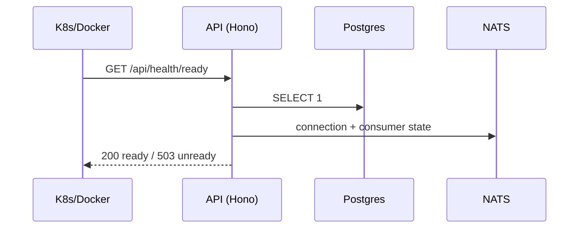

# Health API

> Base path: `/api/health` · 3 endpoints

Infrastructure probes for Kubernetes/Docker: liveness, readiness, and overall status. Public (no auth); readiness gates on Postgres/NATS/event-consumer/Centrifugo.

## Endpoints

**Methods:** GET 3 · POST 0 · DELETE 0 · PATCH 0 · PUT 0

| Method | Path | Access | Description |
|--------|------|--------|-------------|
| GET | `/health/` | — | Overall system health Used by orchestrators to check if the service is functioning |
| GET | `/health/live` | — | Liveness probe Kubernetes uses this to determine if the pod should be restarted |
| GET | `/health/ready` | — | Readiness probe Kubernetes uses this to determine if the pod is ready to receive traffic |

## Flows

### Readiness probe

