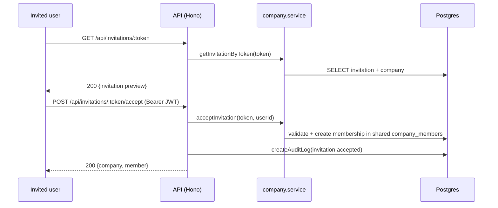

# Invitations (token acceptance) API

> Base path: `/api/invitations` · 2 endpoints

Public token endpoints for previewing and accepting a workspace invitation. `GET /:token` is public; `POST /:token/accept` requires authentication but **no** tenant context (the user is not a member yet).

## Endpoints

**Methods:** GET 1 · POST 1 · DELETE 0 · PATCH 0 · PUT 0

| Method | Path | Access | Description |
|--------|------|--------|-------------|
| GET | `/invitations/:token` | Public | Get invitation details (for preview before accepting) |
| POST | `/invitations/:token/accept` | Authenticated | Accept invitation |

## Flows

### Accept invitation

