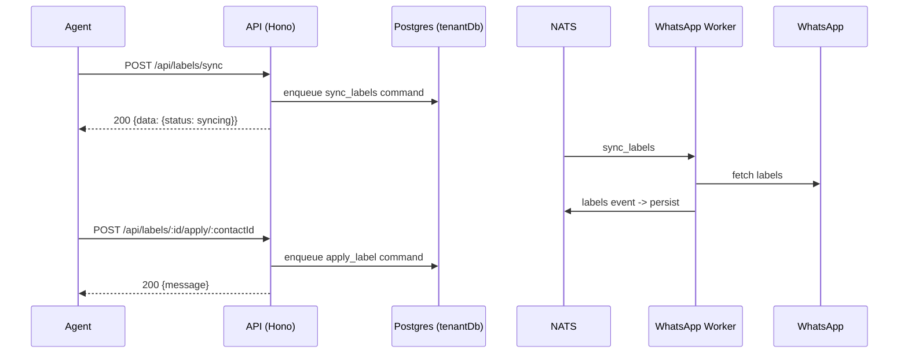

# Labels API

> Base path: `/api/labels` · 10 endpoints

WhatsApp labels sync and contact label application. Sync and apply/remove are asynchronous worker commands; list endpoints read the synced label state from the tenant schema.

## Endpoints

**Methods:** GET 4 · POST 4 · DELETE 2 · PATCH 0 · PUT 0

| Method | Path | Access | Description |
|--------|------|--------|-------------|
| GET | `/labels` | Authenticated · Tenant context · `can_manage_connections` | List all WhatsApp labels with optional pagination |
| GET | `/labels/:labelId` | Authenticated · Tenant context · `can_manage_connections` | Get a specific WhatsApp label |
| DELETE | `/labels/:labelId/apply/:contactId` | Authenticated · Tenant context · `can_manage_connections` | Queue removing a label from a contact (200) |
| POST | `/labels/:labelId/apply/:contactId` | Authenticated · Tenant context · `can_manage_connections` | Queue applying a label to a contact (200) |
| DELETE | `/labels/:labelId/link` | Authenticated · Tenant context · `can_manage_connections` | Unlink a tag from a WhatsApp label |
| POST | `/labels/:labelId/link` | Authenticated · Tenant context · `can_manage_connections` | Link a tag to a WhatsApp label |
| POST | `/labels/auto-create` | Authenticated · Tenant context · `can_manage_connections` | Auto-create tags from unlinked WhatsApp labels |
| GET | `/labels/status` | Authenticated · Tenant context · `can_manage_connections` | Get label sync status summary |
| POST | `/labels/sync` | Authenticated · Tenant context · `can_manage_connections` | Queue a label sync request (200) |
| GET | `/labels/tags/with-status` | Authenticated · Tenant context · `can_manage_connections` | Get all tags with their label sync status |

## Flows

### Sync & apply label

