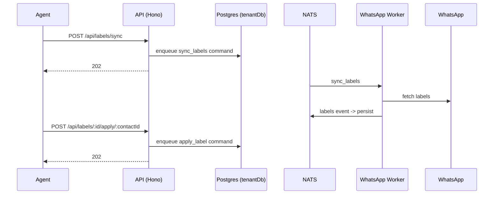

# Labels API

> Base path: `/api/labels` · 10 endpoints

WhatsApp labels sync and contact label application. Sync and apply/remove are asynchronous worker commands; list endpoints read the synced label state from the tenant schema.

## Endpoints

**Methods:** GET 4 · POST 4 · DELETE 2 · PATCH 0 · PUT 0

| Method | Path | Access | Description |
|--------|------|--------|-------------|
| GET | `/labels/` | — | List all WhatsApp labels with optional pagination |
| GET | `/labels/:labelId` | — | Get a specific WhatsApp label |
| POST | `/labels/:labelId/apply/:contactId` | — | Apply a WhatsApp label to a contact This syncs the label to WhatsApp |
| DELETE | `/labels/:labelId/apply/:contactId` | — | Remove a WhatsApp label from a contact This syncs the removal to WhatsApp |
| POST | `/labels/:labelId/link` | — | Link a tag to a WhatsApp label |
| DELETE | `/labels/:labelId/link` | — | Unlink a tag from a WhatsApp label |
| POST | `/labels/auto-create` | — | Auto-create tags from unlinked WhatsApp labels |
| GET | `/labels/status` | — | Get label sync status summary |
| POST | `/labels/sync` | — | Trigger a sync of labels from WhatsApp This sends a command to the Go service to fetch labels |
| GET | `/labels/tags/with-status` | — | Get all tags with their label sync status |

## Flows

### Sync & apply label

