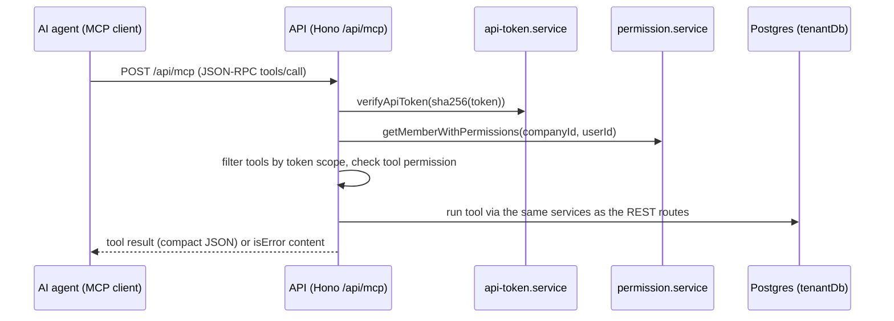

# MCP API

> Base path: `/api/mcp` · 3 endpoints

Stateless Streamable HTTP MCP endpoint for AI agents. Authenticated with an API token (`Authorization: Bearer wti_...`) instead of a JWT; the workspace is resolved from the token, so no `X-Company-ID` header is used. Tools are filtered by token scope (`read`/`write`) at listing time, and the owner's live role/permissions and contact visibility are re-checked on every call. POST-only: GET/DELETE return 405 (no SSE stream or session lifecycle).

## Endpoints

**Methods:** GET 1 · POST 1 · DELETE 1 · PATCH 0 · PUT 0

| Method | Path | Access | Description |
|--------|------|--------|-------------|
| DELETE | `/mcp` | Public |  |
| GET | `/mcp` | Public |  |
| POST | `/mcp` | Public · Rate limited | Stateless Streamable HTTP MCP endpoint. |

## Flows

### Tool call

