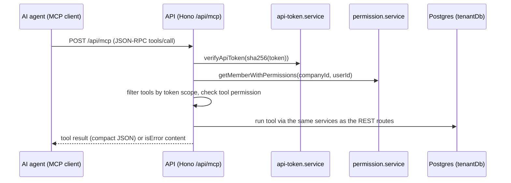

# MCP API

> Base path: `/api/mcp` · 3 endpoints

Stateless Streamable HTTP MCP endpoint for AI agents. Authenticated with an API token (`Authorization: Bearer wti_...`) instead of a JWT; the workspace is resolved from the token, so no `X-Company-ID` header is used. Tools are filtered by token scope (`read`/`write`) at listing time, and the owner's live role/permissions and contact visibility are re-checked on every call. POST-only: GET/DELETE return 405 (no SSE stream or session lifecycle).

## Endpoints

**Methods:** GET 1 · POST 1 · DELETE 1 · PATCH 0 · PUT 0

| Method | Path | Access | Description |
|--------|------|--------|-------------|
| DELETE | `/mcp` | Public |  |
| GET | `/mcp` | Public |  |
| POST | `/mcp` | Public · Rate limited | Stateless Streamable HTTP MCP endpoint. |

## Flows

### Tool call

## Prepare contacts and schedule individual text messages

`create_contact` creates a contact without sending anything or opening a case.
Pass `phoneNumber`, optional `customName`/`notesShared`, and `connectionId` from
`list_connections` when multiple accounts are connected. A duplicate on that
connection is reused without overwriting its profile; hidden contacts are not
returned. Phone normalization does not verify WhatsApp registration.

Add shared notes with `add_contact_note` and apply tags with `tag_contact`.
Before the first scheduled message, open the conversation using
`update_conversation_state` with `action: "open"`. Resolved conversations require
an explicit `reopen` with a reason, as with normal sends.

`schedule_message` accepts `contactId`, `content`, `scheduledAt` (ISO datetime
with timezone), and a client-generated UUID `scheduledMessageId`. Confirm the
recipient, wording and time before scheduling. The time must be 30 seconds to
one year ahead. Reuse the same UUID and payload after an uncertain response:
concurrent retries return the same row, and different payloads are rejected.
An existing matching request returns its current status even after its due time.

This writes a normal individual schedule, with no broadcast job. It requires
write scope and `can_send_messages`, shares the REST scheduling rate budget,
and enforces the same blocking, assignment and active-case guards. Dispatch
runs server-side and rechecks access. The contact's connection determines the
sender. `send_message` remains immediate. Inspect/cancel pending messages in
the app's scheduled-message UI; those actions are not added to MCP here.

## Workspace SLA, quick replies, and first-contact replies

MCP server version `1.3.0` adds the following tools. All workspace IDs come from
the authenticated token; callers cannot select another tenant.

| Tools | Scope | Access / behavior |
|-------|-------|-------------------|
| `get_sla_policy`, `list_sla_policy_history` | read | Any workspace member; current policy and immutable history |
| `update_sla_policy` | write | Live owner/admin role required; creates a new policy version |
| `list_quick_replies`, `get_quick_reply` | read | Shared templates, full content; list supports search, limit (max 50), offset |
| `create_quick_reply`, `update_quick_reply`, `delete_quick_reply` | write | Same member access and tenant isolation as the app |
| `get_auto_reply_settings` | read | Current first-contact reply rule |
| `update_auto_reply_settings` | write | Same member access as the app; replaces the rule |

Read the current SLA before updating it. Supply `targetMinutes`,
`directResolutionTargetMinutes`, `groupResponseTargetMinutes`,
`groupResolutionTargetMinutes`, `timezone`, `weeklySchedule`, and `exceptions`
using the REST policy shape. Existing cases retain their original policy.
After an uncertain result, inspect history before retrying: each save creates
another immutable version.

Quick replies have `shortcut`, `title`, and `content`; edits and deletes use
`quickReplyId`. Editing content also updates scheduled automatic replies using
that template. Deleting the active template disables its rule and cancels its
pending automatic replies.

Automatic reply updates require `enabled`, nullable `quickReplyId`,
`delayMinutes` (1–1440), and `sendMode` (`always` or `outside_business_hours`).
Enabling requires a template and authorizes future outbound messages: confirm
its wording, delay, and mode first. Outside-hours mode uses the SLA calendar.
Replies apply once per direct contact, exclude history sync, and skip delivery
if the team replies during the wait. Saving the rule cancels pending automatic
replies; future first contacts use the new configuration.
