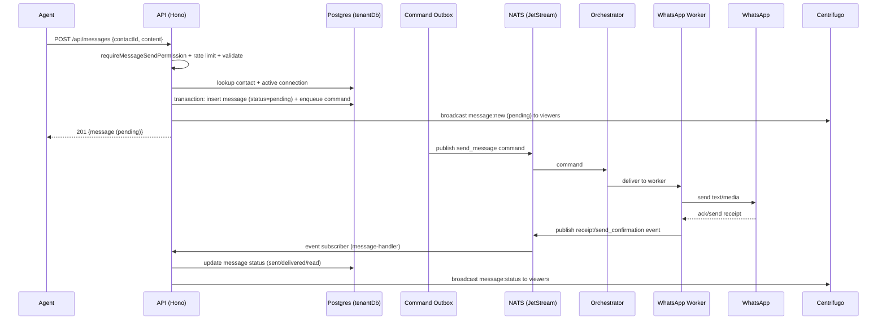
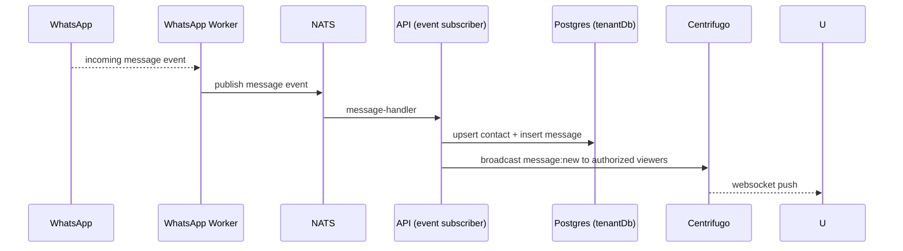

# Messages API

> Base path: `/api/messages`, `/api/messages/batch` · 15 endpoints

Sending, fetching, reacting to, starring, and scheduling messages, plus batch operations. Sending is **asynchronous**: the message is stored `pending`, a command is enqueued, and delivery/status updates flow back through NATS and the WhatsApp worker.

## Endpoints

**Methods:** GET 3 · POST 8 · DELETE 4 · PATCH 0 · PUT 0

| Method | Path | Access | Description |
|--------|------|--------|-------------|
| GET | `/messages/` | — | Get messages for a contact |
| POST | `/messages/` | `can_send_messages` · Rate limited | Send a new message |
| DELETE | `/messages/:id` | `can_delete` · Message visibility | Soft delete a message |
| POST | `/messages/:id/forward` | Message visibility · `can_send_messages` · Rate limited | Forward a message to another contact |
| POST | `/messages/:id/reaction` | — | Add a reaction to a message |
| DELETE | `/messages/:id/reaction` | — | Remove a reaction from a message |
| POST | `/messages/:id/retry` | Message visibility · `can_send_messages` · Rate limited | Retry a failed message |
| POST | `/messages/:id/star` | — | Star a message |
| DELETE | `/messages/:id/star` | — | Unstar a message |
| POST | `/messages/scheduled` | `can_send_messages` · Rate limited | Schedule a message for future delivery |
| GET | `/messages/scheduled` | — | List a conversation's scheduled messages |
| DELETE | `/messages/scheduled/:id` | `can_send_messages` | Cancel a scheduled message Only rows that have not started dispatching (or already failed) can be canceled; a row being processed is past the point of no return. |
| GET | `/messages/starred` | — | Get all starred messages |
| POST | `/messages/batch/delete` | `can_delete` | Soft delete multiple messages at once |
| POST | `/messages/batch/star` | — | Star/unstar multiple messages at once |

## Flows

### Send message (async)

### Inbound message

