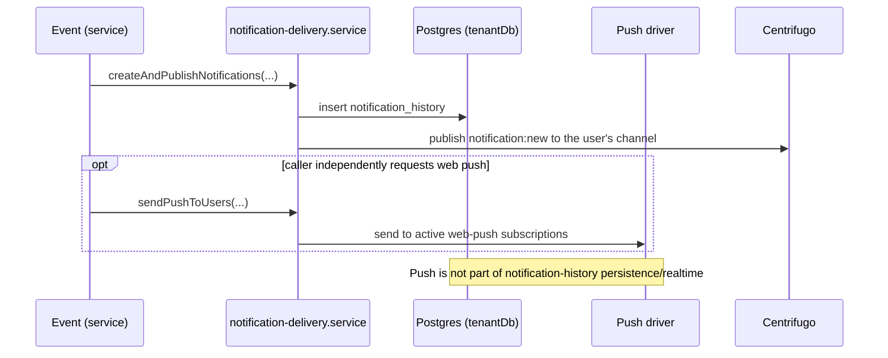

# Notifications API

> Base path: `/api/notifications` · 15 endpoints

In-app notifications, read state, mute, preferences, and web-push subscriptions. Notification history/realtime delivery and web-push are separate delivery paths; push subscriptions do not themselves create or modify in-app notification rows.

## Endpoints

**Methods:** GET 5 · POST 5 · DELETE 3 · PATCH 2 · PUT 0

| Method | Path | Access | Description |
|--------|------|--------|-------------|
| GET | `/notifications` | Authenticated · Tenant context | List notifications for the current user |
| POST | `/notifications` | Authenticated · Tenant context | Create a notification (for system/internal use) |
| DELETE | `/notifications/:id` | Authenticated · Tenant context | Delete a notification |
| GET | `/notifications/:id` | Authenticated · Tenant context | Get a single notification |
| PATCH | `/notifications/:id/read` | Authenticated · Tenant context | Mark a notification as read |
| GET | `/notifications/count` | Authenticated · Tenant context | Get unread notification count |
| POST | `/notifications/mute` | Authenticated · Tenant context | Mute a contact |
| GET | `/notifications/preferences` | Authenticated · Tenant context | Get notification preferences |
| PATCH | `/notifications/preferences` | Authenticated · Tenant context | Update notification preferences |
| GET | `/notifications/push/status` | Authenticated · Tenant context | Get web-push subscription status |
| DELETE | `/notifications/push/subscribe` | Authenticated · Tenant context | Unsubscribe from web-push notifications |
| POST | `/notifications/push/subscribe` | Authenticated · Tenant context | Subscribe to web-push notifications |
| DELETE | `/notifications/push/subscriptions` | Authenticated · Tenant context | Remove all web-push subscriptions |
| POST | `/notifications/read-all` | Authenticated · Tenant context | Mark all notifications as read |
| POST | `/notifications/unmute` | Authenticated · Tenant context | Unmute a contact |

## Flows

### Notification delivery

