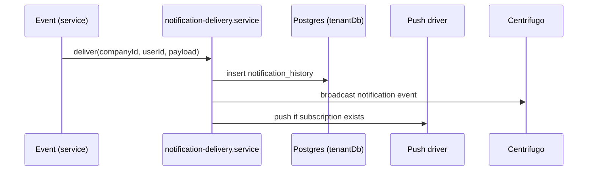

# Notifications API

> Base path: `/api/notifications` · 15 endpoints

In-app notifications, read state, mute, preferences, and web-push subscriptions. Delivery combines DB-persisted notification history with optional push via web-push subscriptions.

## Endpoints

**Methods:** GET 5 · POST 5 · DELETE 3 · PATCH 2 · PUT 0

| Method | Path | Access | Description |
|--------|------|--------|-------------|
| GET | `/notifications/` | — | List notifications for the current user |
| POST | `/notifications/` | — | Create a notification (for system/internal use) |
| GET | `/notifications/:id` | — | Get a single notification |
| DELETE | `/notifications/:id` | — | Delete a notification |
| PATCH | `/notifications/:id/read` | — | Mark a notification as read |
| GET | `/notifications/count` | — | Get unread notification count |
| POST | `/notifications/mute` | — | Mute a contact |
| GET | `/notifications/preferences` | — | Get notification preferences |
| PATCH | `/notifications/preferences` | — | Update notification preferences |
| GET | `/notifications/push/status` | — | Get web-push subscription status |
| POST | `/notifications/push/subscribe` | — | Subscribe to web-push notifications |
| DELETE | `/notifications/push/subscribe` | — | Unsubscribe from web-push notifications |
| DELETE | `/notifications/push/subscriptions` | — | Remove all web-push subscriptions |
| POST | `/notifications/read-all` | — | Mark all notifications as read |
| POST | `/notifications/unmute` | — | Unmute a contact |

## Flows

### Notification delivery

