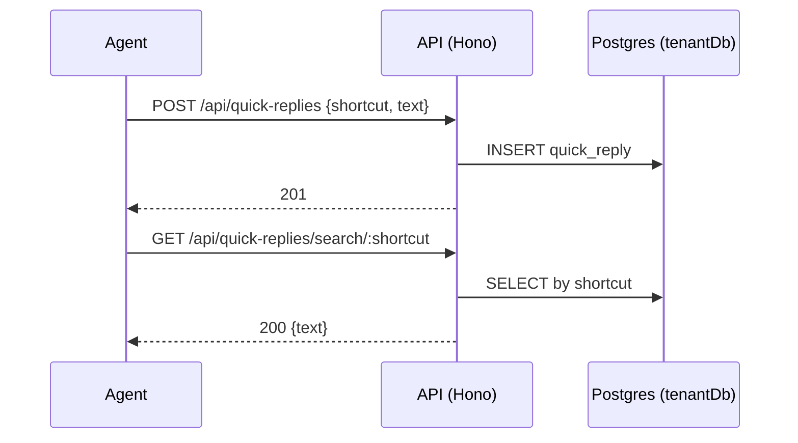

# Quick Replies API

> Base path: `/api/quick-replies` · 6 endpoints

Canned/shortcut replies. Synchronous CRUD; `GET /search/:shortcut` lets the composer resolve a shortcut to its expansion.

## Endpoints

**Methods:** GET 3 · POST 1 · DELETE 1 · PATCH 1 · PUT 0

| Method | Path | Access | Description |
|--------|------|--------|-------------|
| GET | `/quick-replies/` | — | List all quick replies |
| POST | `/quick-replies/` | — | Create a new quick reply |
| GET | `/quick-replies/:id` | — | Get a quick reply by ID |
| PATCH | `/quick-replies/:id` | — | Update a quick reply |
| DELETE | `/quick-replies/:id` | — | Delete a quick reply |
| GET | `/quick-replies/search/:shortcut` | — | Search by shortcut (for autocomplete) |

## Flows

### Quick reply CRUD & lookup

