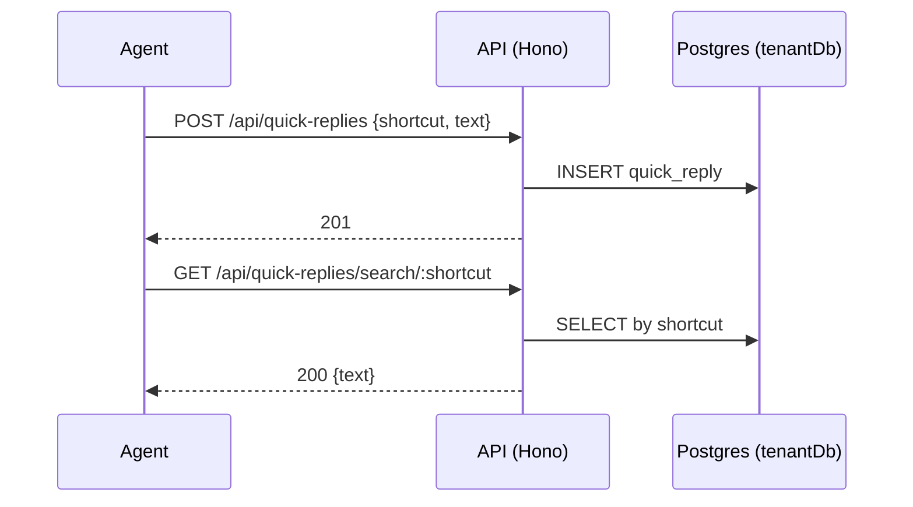

# Quick Replies API

> Base path: `/api/quick-replies` · 8 endpoints

Canned/shortcut replies. Synchronous CRUD; `GET /search/:shortcut` lets the composer resolve a shortcut to its expansion. Workspace first-contact auto-reply settings live under `/auto-reply`.

## Endpoints

**Methods:** GET 4 · POST 1 · DELETE 1 · PATCH 1 · PUT 1

| Method | Path | Access | Description |
|--------|------|--------|-------------|
| GET | `/quick-replies` | Authenticated · Tenant context | List all quick replies |
| POST | `/quick-replies` | Authenticated · Tenant context | Create a new quick reply |
| DELETE | `/quick-replies/:id` | Authenticated · Tenant context | Delete a quick reply |
| GET | `/quick-replies/:id` | Authenticated · Tenant context | Get a quick reply by ID |
| PATCH | `/quick-replies/:id` | Authenticated · Tenant context | Update a quick reply |
| GET | `/quick-replies/search/:shortcut` | Authenticated · Tenant context | Search by shortcut (for autocomplete) |
| GET | `/quick-replies/auto-reply` | Authenticated · Tenant context | Get first-contact auto-reply settings |
| PUT | `/quick-replies/auto-reply` | Authenticated · Tenant context | Update first-contact auto-reply settings |

## Flows

### Quick reply CRUD & lookup

