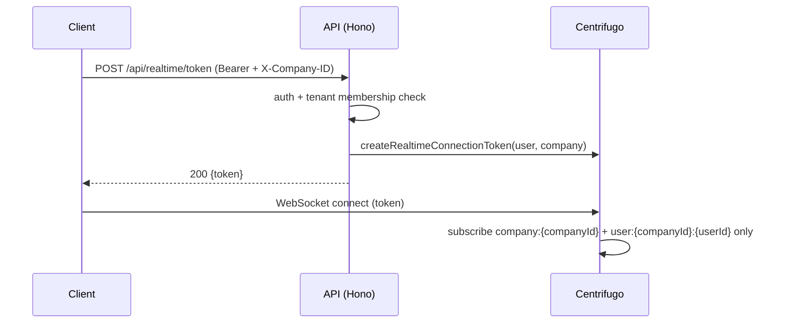

# Realtime (Centrifugo token) API

> Base path: `/api/realtime` · 1 endpoints

Issues a short-lived Centrifugo connection token after authenticated workspace membership resolution. The token grants exactly the workspace company channel and the caller's company-scoped user channel; conversation visibility is enforced by server-side fanout to user channels.

## Endpoints

**Methods:** GET 0 · POST 1 · DELETE 0 · PATCH 0 · PUT 0

| Method | Path | Access | Description |
|--------|------|--------|-------------|
| POST | `/realtime/token` | Authenticated · Tenant context | Issue a short-lived Centrifugo connection token. The server-side channel subscriptions are derived exclusively from the authenticated user and their verified current company membership. |

## Flows

### Realtime connect

