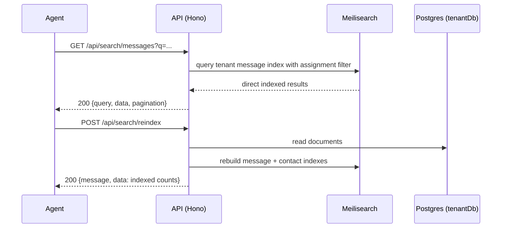

# Search API

> Base path: `/api/search` · 5 endpoints

Full-text search across messages and contacts, backed by Meilisearch with a PostgreSQL fallback. Results are returned directly by the search service (not hydrated afterward). `POST /reindex` requires Admin/Owner role, rebuilds both tenant indexes, and returns 200.

## Endpoints

**Methods:** GET 4 · POST 1 · DELETE 0 · PATCH 0 · PUT 0

| Method | Path | Access | Description |
|--------|------|--------|-------------|
| GET | `/search` | Authenticated · Tenant context · Rate limited · Contact visibility (result-filtered) | Global search across messages and contacts |
| GET | `/search/contacts` | Authenticated · Tenant context · Rate limited · Contact visibility (result-filtered) | Search contacts only |
| GET | `/search/messages` | Authenticated · Tenant context · Rate limited · Contact visibility (result-filtered) | Search messages only |
| POST | `/search/reindex` | Authenticated · Tenant context · Admin role | Rebuild the tenant's message and contact indexes (200) |
| GET | `/search/status` | Authenticated · Tenant context | Get search engine status |

## Flows

### Search & reindex

