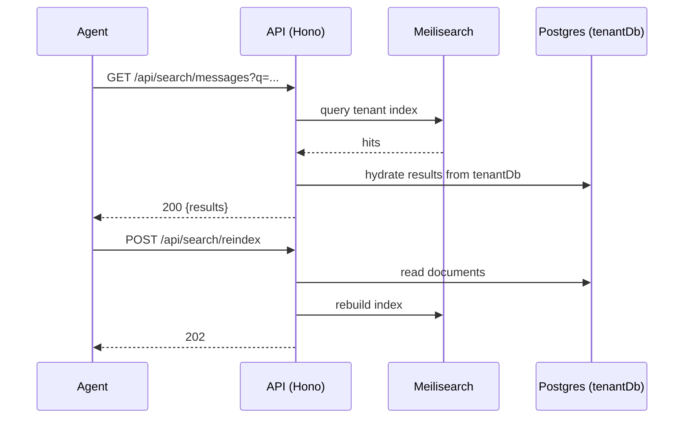

# Search API

> Base path: `/api/search` · 5 endpoints

Full-text search across messages, contacts, and status, backed by Meilisearch. `POST /reindex` rebuilds the tenant index.

## Endpoints

**Methods:** GET 4 · POST 1 · DELETE 0 · PATCH 0 · PUT 0

| Method | Path | Access | Description |
|--------|------|--------|-------------|
| GET | `/search/` | Rate limited | Global search across messages and contacts |
| GET | `/search/contacts` | Rate limited | Search contacts only |
| GET | `/search/messages` | Rate limited | Search messages only |
| POST | `/search/reindex` | — | Rebuild search indexes (admin only) |
| GET | `/search/status` | — | Get search engine status |

## Flows

### Search & reindex

