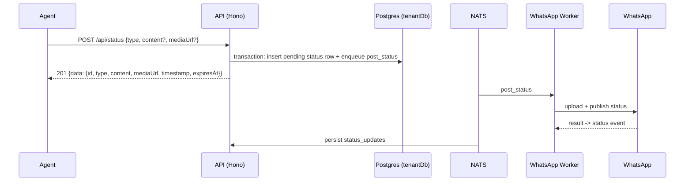

# Status (Stories) API

> Base path: `/api/status` · 6 endpoints

WhatsApp Status (stories) posting and reading. Posting creates a pending local row and asynchronously commands the worker; status events are broadcast workspace-wide by policy. Deletion is creator-only and removes the local row—it does not retract a story from WhatsApp.

## Endpoints

**Methods:** GET 4 · POST 1 · DELETE 1 · PATCH 0 · PUT 0

| Method | Path | Access | Description |
|--------|------|--------|-------------|
| GET | `/status` | Authenticated · Tenant context | List all status updates (not expired) |
| POST | `/status` | Authenticated · Tenant context | Create a pending local status and queue publication (201) |
| DELETE | `/status/:id` | Authenticated · Tenant context · Creator only | Delete the creator's local status row only (does not retract it from WhatsApp) |
| GET | `/status/:jid` | Authenticated · Tenant context | Get all status updates from a specific contact |
| GET | `/status/my` | Authenticated · Tenant context | Get my posted status updates |
| GET | `/status/stats/overview` | Authenticated · Tenant context | Get status statistics |

## Flows

### Post status

