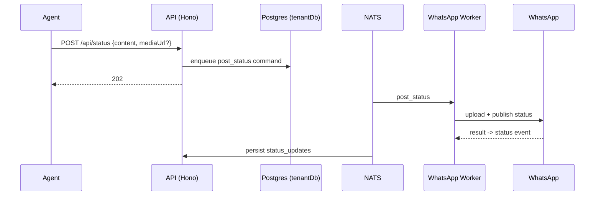

# Status (Stories) API

> Base path: `/api/status` · 6 endpoints

WhatsApp Status (stories) posting and reading. Posting is asynchronous via the worker; status events are broadcast workspace-wide by policy.

## Endpoints

**Methods:** GET 4 · POST 1 · DELETE 1 · PATCH 0 · PUT 0

| Method | Path | Access | Description |
|--------|------|--------|-------------|
| GET | `/status/` | — | List all status updates (not expired) |
| POST | `/status/` | — | Post a new status update |
| DELETE | `/status/:id` | — | Delete a posted status |
| GET | `/status/:jid` | — | Get all status updates from a specific contact |
| GET | `/status/my` | — | Get my posted status updates |
| GET | `/status/stats/overview` | — | Get status statistics |

## Flows

### Post status

