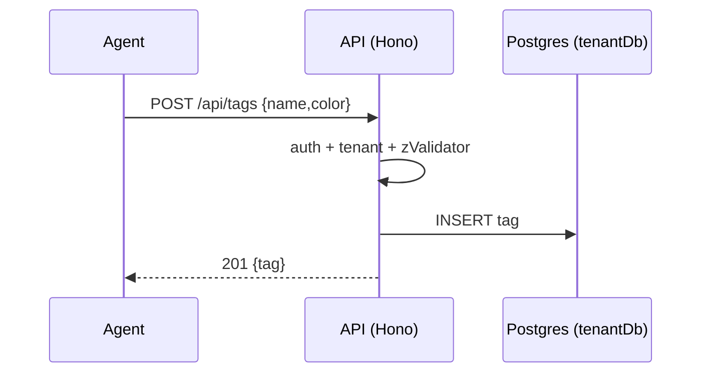

# Tags API

> Base path: `/api/tags` · 4 endpoints

Workspace-local contact tags (distinct from WhatsApp labels). Simple synchronous CRUD against the tenant schema.

## Endpoints

**Methods:** GET 1 · POST 1 · DELETE 1 · PATCH 1 · PUT 0

| Method | Path | Access | Description |
|--------|------|--------|-------------|
| GET | `/tags` | Authenticated · Tenant context | List all tags with optional pagination |
| POST | `/tags` | Authenticated · Tenant context | Create a new tag |
| DELETE | `/tags/:id` | Authenticated · Tenant context | Delete a tag |
| PATCH | `/tags/:id` | Authenticated · Tenant context | Update a tag |

## Flows

### Tag CRUD

