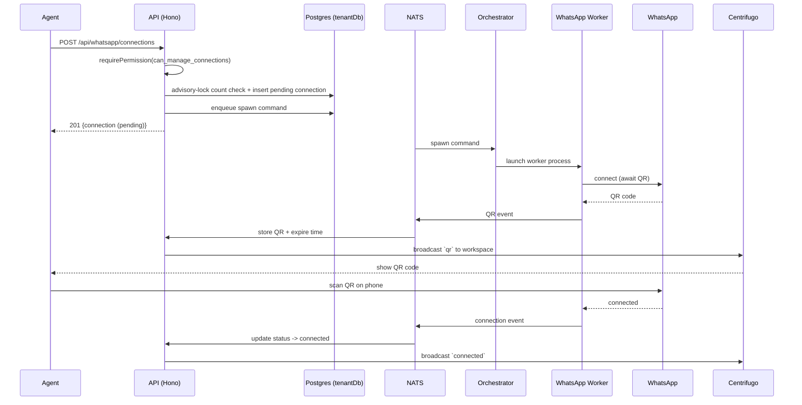
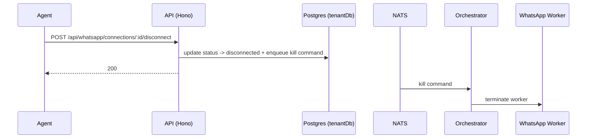

# WhatsApp Connections & Status API

> Base path: `/api/whatsapp`, `/api/whatsapp/connections` · 20 endpoints

Multi-connection management (list/create/rename/archive/purge/reconnect/relink/disconnect) plus legacy single-connection endpoints. Connecting is **asynchronous**: a worker is spawned, a QR code is produced and pushed in realtime, and the scan completes the pairing.

## Endpoints

**Methods:** GET 8 · POST 10 · DELETE 1 · PATCH 1 · PUT 0

| Method | Path | Access | Description |
|--------|------|--------|-------------|
| POST | `/whatsapp/connect` | Authenticated · Tenant context · `can_manage_connections` | Start WhatsApp connection flow (backward compatible) QR codes are delivered on the authenticated company Centrifugo channel. |
| GET | `/whatsapp/connection` | Authenticated · Tenant context | Get detailed connection info (backward compatible) |
| GET | `/whatsapp/connections` | Authenticated · Tenant context | List all WhatsApp connections |
| POST | `/whatsapp/connections` | Authenticated · Tenant context · `can_manage_connections` | Create a new WhatsApp connection |
| DELETE | `/whatsapp/connections/:connectionId` | Authenticated · Tenant context · `can_manage_connections` | Archive the stable account and unlink its current WhatsApp session. Historical inbox data is retained. |
| GET | `/whatsapp/connections/:connectionId` | Authenticated · Tenant context | Get specific connection details |
| PATCH | `/whatsapp/connections/:connectionId` | Authenticated · Tenant context · `can_manage_connections` | Update connection (e.g., rename) |
| POST | `/whatsapp/connections/:connectionId/disconnect` | Authenticated · Tenant context · `can_manage_connections` | Disconnect specific connection |
| POST | `/whatsapp/connections/:connectionId/purge` | Authenticated · Tenant context · `can_manage_connections` · `can_delete` | Permanently erase an archived account and all of its inbox data. |
| POST | `/whatsapp/connections/:connectionId/reconnect` | Authenticated · Tenant context · `can_manage_connections` | Reconnect a disconnected connection |
| POST | `/whatsapp/connections/:connectionId/relink` | Authenticated · Tenant context · `can_manage_connections` | Initiate a new pairing session for an archived connection |
| POST | `/whatsapp/connections/:connectionId/send` | Authenticated · Tenant context · `can_send_messages` · Legacy removed | Removed legacy send endpoint; always returns 410 (use `POST /messages`) |
| GET | `/whatsapp/connections/:connectionId/status` | Authenticated · Tenant context | Get specific connection status |
| GET | `/whatsapp/connections/archived` | Authenticated · Tenant context · `can_manage_connections` | List archived connections |
| POST | `/whatsapp/disconnect` | Authenticated · Tenant context · `can_manage_connections` | Disconnect WhatsApp (backward compatible) Disconnects the first active connection |
| GET | `/whatsapp/limits` | Authenticated · Tenant context | Get connection limits for the company |
| POST | `/whatsapp/send` | Authenticated · Tenant context · `can_send_messages` · Legacy removed | Removed legacy send endpoint; always returns 410 (use `POST /messages`) |
| GET | `/whatsapp/status` | Authenticated · Tenant context | Get WhatsApp connection status (backward compatible) |
| POST | `/whatsapp/sync-reset` | Authenticated · Tenant context | Resets sync status for all connections (failsafe for stuck syncs) |
| GET | `/whatsapp/sync-status` | Authenticated · Tenant context | Gets sync status for all connections (for page reload handling) |

## Flows

### Create connection & QR pairing

### Disconnect (kill)

