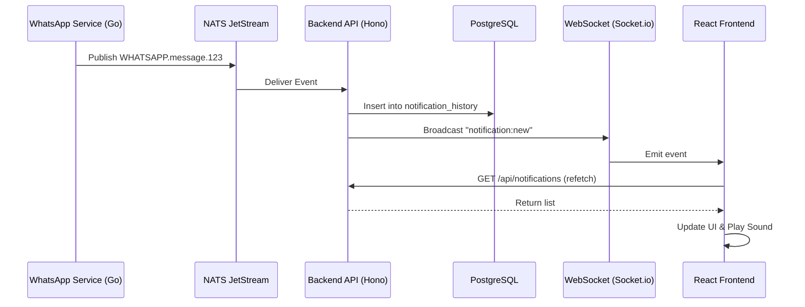

# Notification System Documentation

The notification system in this project is an event-driven architecture that spans the Go services, the Hono API, and the React frontend. It provides real-time alerts for incoming messages, contact assignments, and system events.

## High-Level Architecture

The system follows an asynchronous flow to ensure high performance and reliability:

1.  **Event Source:** The **WhatsApp Service (Go)** receives events from the WhatsApp Web/API client.
2.  **Message Bus:** Events are published to **NATS JetStream** subjects (e.g., `WHATSAPP.message.<company_id>`).
3.  **Event Processor:** The **Backend API (Node.js)** subscribes to these events via a NATS consumer.
4.  **Database Persistence:** The API creates persistent notification records in the `notification_history` table for targeted users.
5.  **Real-Time Trigger:** The API broadcasts a `notification:new` event via **WebSockets**.
6.  **Frontend Delivery:** The **React Frontend** receives the socket signal, refetches data, and updates the UI.

## Component Breakdown

### 1. Go Services (`services/whatsapp`)

- Responsible for capturing raw events from the WhatsApp client (`whatsmeow`).
- Publishes structured JSON payloads to NATS JetStream.
- **Key Event Types:** `message`, `receipt`, `presence`, `chat_state`.

### 2. Backend API (`apps/api`)

- **Subscriber:** `src/services/message-handler.ts` maintains a durable NATS subscription.
- **Processing Logic:** `src/services/handlers/message-handlers.ts` filters events.
  - _Optimization:_ Notifications are skipped during `isHistorySync: true` to prevent flooding.
- **History Service:** `src/services/notification-history.service.ts` manages database CRUD for notifications.
- **WebSocket Broadcast:** Uses `broadcastToCompany` in `src/routes/ws.ts` to notify connected clients.

### 3. Frontend (`apps/web`)

- **Notification Center:** `src/components/notifications/NotificationCenter.tsx` displays the bell icon and dropdown.
- **Data Hook:** `src/hooks/useNotificationCenter.ts` manages the lifecycle:
  - Subscribes to `notification:new` WebSocket events.
  - Triggers TanStack Query refetches for the unread count and list.
- **Browser API:** `src/lib/notifications.ts` handles native browser notifications, permissions, and sounds.

### 4. Database Schema (`packages/database`)

- **`notification_history`**: Per-tenant table storing individual notification items.
  - `user_id`: Recipient ID.
  - `notification_type`: Enum (`message`, `mention`, `assignment`, `system`).
  - `is_read`: Boolean status.
  - `action_url`: Deep link to the relevant UI section.
- **`notification_preferences`**: Stores user-specific settings (e.g., sound enabled, muted contacts).

## Flow Diagram

## Implementation Details

### Notification Types

The `notification_history` table is designed for **non-message events only**:

| Type | Description | Created When |
|------|-------------|--------------|
| `assignment` | Contact reassignment alerts | Contact is reassigned to another team member |
| `mention` | User @mentions | User is mentioned in a message (future) |
| `team` | Team management events | Invites, role changes (future) |
| `system` | System alerts | Maintenance, errors, announcements (future) |

**Important:** Regular message notifications are **intentionally excluded** from `notification_history` because:
1. The chat UI already displays unread message counts via `conversation_states.unread_count`
2. New messages appear in real-time via the `message:new` WebSocket event
3. Creating notification entries for every message would flood the notification center

### Skipping Notifications

During initial synchronization (History Sync), thousands of messages might be imported. To avoid crashing the UI or annoying the user:

- The `isHistorySync` flag in the NATS payload is checked.
- If `true`, the API stores the message but **does not** broadcast a WebSocket event.

### Real-Time Sync

The frontend uses the `useNotificationCenter` hook which utilizes the `useWebSocket` hook. The `notification:new` event is a lightweight "ping" that tells the client its state is stale, prompting a refetch of the unread count and latest notifications.
