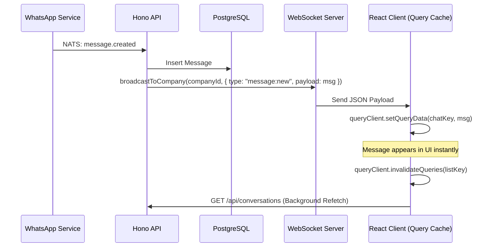
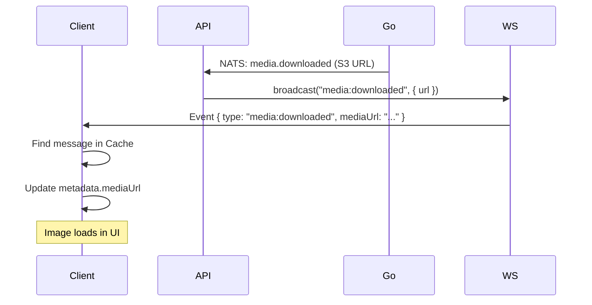

# WebSocket Architecture & Flow

This document details the WebSocket implementation used for real-time updates in the platform. It covers the server-side broadcasting mechanism, client-side connection management, and the event-driven state update strategy.

## Overview

The system uses a **Company-scoped Broadcast** model. Users are authenticated via JWT and associated with a specific Company ID. Events triggered by backend services (e.g., incoming WhatsApp message) are broadcast to all active connections for that company.

## 1. Server-Side Implementation (`apps/api`)

The WebSocket server is built using `hono/bun`'s `createBunWebSocket` adapter.

### Connection Lifecycle (`src/routes/ws.ts`)

1.  **Upgrade**: HTTP requests to `/api/ws` are upgraded to WebSocket connections.
2.  **Authentication**:
    -   Clients must provide a valid JWT `token` and `companyId`.
    -   Authentication can happen via query params (initial connect) or an `auth` message.
    -   The server validates the token and ensures the user belongs to the requested company.
3.  **Tracking**:
    -   Valid connections are stored in a `Map<string, Set<ServerWebSocket>>` where the key is `companyId`.
    -   This allows efficient O(1) lookup for broadcasting to a specific company.

### Broadcasting

The core broadcasting logic resides in `broadcastToCompany`:

```typescript
export function broadcastToCompany(companyId: string, message: ServerMessage): void {
  const companyConnections = connections.get(companyId);
  if (companyConnections) {
    const payload = JSON.stringify(message);
    for (const ws of companyConnections) {
      if (ws.readyState === 1) ws.send(payload);
    }
  }
}
```

Services across the API invoke this function to push updates. For example, when a new message is received from the Go service (via NATS), the message handler persists it to DB and then calls `broadcastToCompany`.

## 2. Client-Side Implementation (`apps/web`)

The frontend uses a singleton `WebSocketClient` managed by a React Context Provider.

### Architecture

-   **`WebSocketClient` (`lib/websocket.ts`)**: A robust class wrapping the native `WebSocket` API. It handles:
    -   Automatic reconnection (exponential backoff).
    -   Heartbeats (ping/pong) to detect stale connections.
    -   Message queueing (buffers messages while connecting).
    -   Type-safe event subscription (`on`, `off`, `once`).
-   **`WebSocketProvider` (`contexts/WebSocketProvider.tsx`)**:
    -   Initializes the client.
    -   Manages authentication tokens.
    -   Handles "Force Reconnect" when the user switches companies.
    -   Exposes `useWebSocketContext` for global state (connection status, sync progress).
-   **Event Handlers (`contexts/websocket/event-handlers.ts`)**:
    -   The "brain" of the realtime system.
    -   Centralizes logic for how the application state responds to events.

### State Update Strategy

We use a hybrid approach of **Direct Cache Manipulation** and **Query Invalidation** using TanStack Query.

#### Pattern A: Direct Cache Update (Optimistic/Real-time)
Used for high-frequency or critical data where we want immediate UI feedback without a network round-trip.

*Example: `message:new`*
1.  Receive payload with the full message object.
2.  **Zustand**: Update legacy chat store.
3.  **TanStack Query**:
    -   Find the specific infinite query cache for the conversation (`infiniteMessageKeys.list(conversationId)`).
    -   Manually inject the new message into the `pages` array via `queryClient.setQueryData`.
    -   **Result**: The message appears instantly in the chat window.

#### Pattern B: Invalidation (Refetch)
Used for derived state or lists where complex sorting/filtering makes direct updates risky.

*Example: `conversation:read`*
1.  Receive payload indicating a conversation was read.
2.  **TanStack Query**:
    -   Call `queryClient.invalidateQueries({ queryKey: chatKeys.lists() })`.
    -   **Result**: The chat list re-fetches from the API, updating the unread count badges and sorting order.

## Event Reference

| Event Type | Payload | Action |
| :--- | :--- | :--- |
| `message:new` | `message`, `conversationId` | Appends message to chat window cache. Invalidates chat list. |
| `message:status` | `messageId`, `status` | Updates status ticks (sent/delivered/read) in chat window cache. |
| `message:deleted` | `messageId` | Marks message as deleted in cache (soft delete). |
| `typing:start` | `userId`, `conversationId` | Shows typing indicator (ephemeral). |
| `contact:profile_picture` | `jid`, `url` | Updates avatar in chat list and header cache. |
| `presence:online/offline` | `jid`, `lastSeen` | Updates online status dot in chat list. |
| `sync:progress` | `conversations` | Updates the global sync progress bar. |
| `media:downloaded` | `mediaUrl` | Swaps loading placeholder with actual media URL in message cache. |

## Flow Diagrams

### 1. Incoming Message Flow



### 2. Media Download Flow


